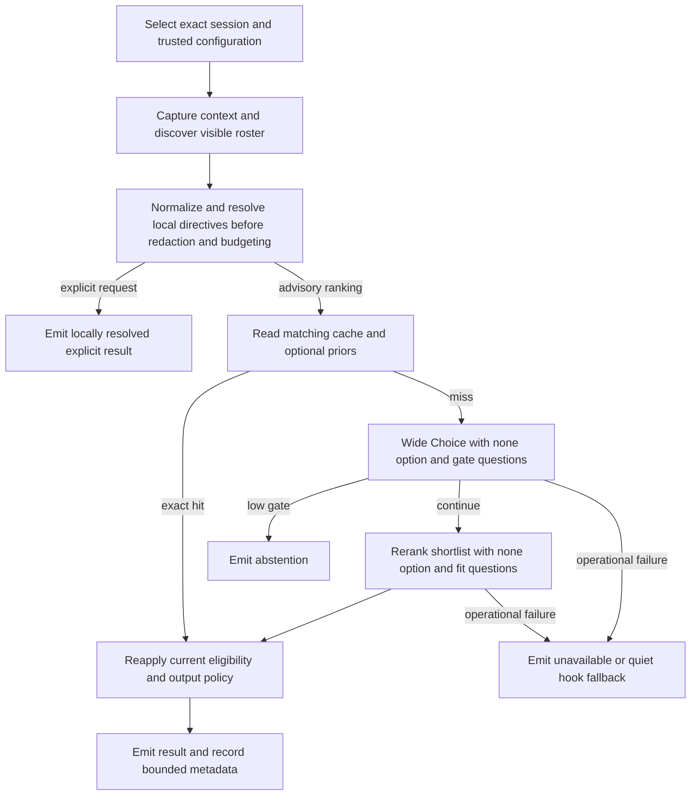

# SkillRanker (sr) — Design and Implementation Plan

2026-09-17 · Revised after source and contract review

## Purpose and scope

SkillRanker (`sr`) is a standalone Rust CLI that recommends skills for the next step of an agent session. It captures bounded context, resolves the skills the harness can actually load, and uses TypeSafe's Jev for a broad selection followed by a more detailed rerank. Interactive output shows up to five eligible candidates; the default hook suggests at most one. Abstention is a normal result.

The useful product is a fast, advisory selector with inspectable evidence. It does not load or execute skills, override user instructions, grant tool permissions, or decide whether an agent may continue. A failed recommendation service must not prevent the agent from working.

The initial release targets local Linux and macOS, Claude Code's `UserPromptSubmit` hook, explicit transcript input, and a versioned normalized-context format. Other harnesses can use that format immediately through an integration they control; native Codex, omp/pi, and Grok adapters require their own verified contracts before they are advertised.

**No `ms` dependency:** reuse selected code and tests from `meta_skill` inside this project. Do not invoke its CLI, link its application crate, read its private database, inherit its configuration, or write outcomes into it. Discovery, parsing, redaction, retrieval, statistics, and feedback belong to `sr`.

Documentation alignment is a P0 prerequisite: README.md and AGENTS.md were added concurrently from the earlier design and still describe an `ms` bridge, old gates/weights, and earlier CLI/deadline behavior. Reconcile those product-design passages with this reviewed plan before implementation; preserve their unrelated repository, licensing, coordination, and release rules. Their command examples are proposed interfaces, not evidence that a working binary exists.

### Evidence and limits of the starting recipe

The [TypeSafe skill-suggestion cookbook](https://docs.typesafe.ai/cookbooks/skill_suggestion) reports wrong-load rates falling from 16.8% to 7.3% on 315 covered requests, and needless-load rates falling from 9.8% to 4.0% on 173 uncovered requests. Its experiment used 182 Hermes skills, a three-skill shortlist, one injected suggestion, and `claude-haiku-4-5-20251001`. These are separate denominators and a particular evaluation setup, not measured results for SkillRanker.

Live multi-turn context, an eight-skill shortlist, new gate questions, personalization, and other harnesses are hypotheses to evaluate. The cookbook motivates the architecture; it does not establish our latency, cost, calibration, or effect on task success.

### Core invariants

1. Context, roster visibility, loaded-state evidence, cache entries, and feedback are bound to a workspace **and a specific session/agent branch**.
2. Explicit user skill requests and harness requirements cannot be vetoed by a probability threshold, prior, or cache. User exclusions take precedence over advisory suggestions.
3. Only locally resolved, currently loadable candidates can appear in actionable output. Provider answers cannot introduce names, paths, or commands.
4. `abstain`, `unavailable`, `explicit`, and `ranked` are different decisions. A timeout is never evidence that no skill fits.
5. Provider probabilities, local ranking scores, observed loads, and independently judged usefulness remain separate quantities.
6. Every input, subprocess, request, retry, persistence operation, and output has a bound. An HTTP-only timeout is insufficient.
7. No raw transcript or request body is persisted by default. Redaction covers all outgoing fields, including roster excerpts.
8. No skill is executed, edited, installed, or created by ranking, diagnostics, or feedback.

## Architecture and latency



Capture and discovery may overlap after the workspace/session identity is established. Wide and rerank calls are dependent. Optional ledger reads do not authorize using another session's state. Persistence never holds a transaction across a network call.

Design targets, to be measured on named hardware, roster size, network region, and provider model:

| Path | Initial target | Meaning |
| --- | --- | --- |
| Exact cache hit | p95 ≤100 ms | Includes validation, context tail, discovery validation, and process startup |
| Warm hook, network required | p50 ≤600 ms; p95 ≤1,500 ms | Aspirational end-to-end targets, not provider guarantees |
| Hook deadline | 3,000 ms total | Starts at process entry; reserve the final 200 ms for output/cleanup |
| Cold CLI/cass | Same configurable deadline; report stage timings | Never silently extend the timeout because discovery was slow |

The installer sets the harness timeout above `sr`'s deadline (initially 4 seconds for a 3-second run). Scheduler pauses and uninterruptible OS I/O prevent a mathematical wall-clock guarantee; slow-path tests must demonstrate bounded behavior under the supported operating conditions. If cancellation cannot bound a leaf operation, redesign that leaf before enabling it in hooks.

A process launched per prompt does not inherit an earlier process's connection pool, DNS cache, or in-memory roster. Measure cold TLS and process startup separately. A persistent service is deferred until measurements justify its lifecycle and security costs.

Default installation runs once per submitted user prompt, not once per tool call. Watch mode and future tool-event hooks have separate rate limits; a forty-tool burst is not assumed to cost one request.

## Context capture and session identity

### Source selection

Source flags are mutually exclusive. An explicitly selected source that fails must report its failure; it must not fall through to a different conversation.

| Mode | Selection and behavior |
| --- | --- |
| `sr hook claude` | Read bounded hook JSON from stdin; use its session identity, transcript path, cwd, event, and current prompt |
| `sr rank --context FILE` | Read versioned normalized context; `-` means stdin |
| `sr rank --transcript FILE --harness NAME` | Read a supported native format; unsupported formats produce a typed error |
| `sr rank --session PATH` | Use the optional cass adapter for this exact session, preserving its source identity |
| `sr rank` | Discover local sessions for the resolved workspace; select only an unambiguous candidate or ask for explicit selection in a TTY |

Non-TTY input does not automatically mean hook JSON, and piped content is not silently consumed as a transcript. Require an explicit stdin mode. The hook never guesses a session from “latest in this workspace.”

The optional cass adapter uses capability/version checks, then `cass sessions --workspace <cwd> --json` and `cass export <path> --format json --include-tools`. Preserve `source_id` when supplied, reject remote-source records by default, and paginate or report incomplete discovery. Listing recent sessions alone does not establish which one is live. If recency is offered as a convenience, require `--latest` and disclose that selection.

Installed cass 0.8.0 supports these commands, but its export JSON can retain native message shapes. It also strips skill injections by default. Normalize exported records explicitly and represent missing skill-load evidence as unknown. Apply our own tool-content filtering: the inspected JSON export branch serializes messages directly and must not be treated as enforcing `--no-tools`. The cass daemon is described as a semantic-model daemon, not a general guarantee of warm session export.

Cass is optional and used for archive access and broader format coverage. It is not on the default Claude hook path and is never auto-indexed or started as a daemon by `sr`.

### Hook-specific correctness

For Claude `UserPromptSubmit`, the stdin `prompt` is authoritative for the new request; it may not yet appear in the transcript. Overlay it once and deduplicate only with an event/message identity or a proven adapter rule, not text equality alone. Repeated identical user messages can be distinct turns.

Validate the event name, payload types, session identifier, and transcript association before reading. Use the harness's agent/branch identifier when present; parent and subagent sessions must not share cursors or demotions. When identifiers are missing, use a documented adapter-specific fallback and mark attribution quality.

A transcript path grants read access to that session file, not to arbitrary referenced paths. Reject directories, devices, FIFOs, and unexpected symlink targets; permitted transcript roots come from the adapter or explicit user input. Do not recursively read paths mentioned in a message.

The first prompt can be ranked with the hook prompt and an empty transcript when the transcript file does not yet exist. Record `context_quality: prompt_only`; malformed existing transcripts are a different case and must not silently become an empty history.

### Normalized input is not provider state

`--context` accepts a versioned **local envelope** containing `schema_version`, `harness`, `workspace_root`, `session_id`, `agent_id`, `branch_id`, `context_epoch`, `current_request`, and `events`. `current_request` contains an event ID when available, its text, and any attachment/omission indicators. Missing agent/branch IDs use explicit nulls with unknown attribution, not a shared empty-string identity. A standalone input without durable session identity gets an invocation-local namespace and cannot update persistent session observations.

The envelope may carry source provenance and explicit skill references, but cannot grant networking, filesystem roots, credentials, tool permissions, or successful delivery. Caller-supplied loaded-state claims are labeled `supplied`, not independently observed. Validate the envelope before converting it into the separate allowlisted provider schema below; never serialize it wholesale to Jev.

Resolve explicit requests and exclusions from the full bounded local user input **before** redaction, windowing, or prompt truncation. Keep their local IDs outside model interpretation. If a request is too large to inspect safely, report unavailable rather than resolving only its prefix. Resolve contradictory positive/negative references as `conflicting-directives`; do not guess which directive overrides the other.

A terse continuation needs an active task anchor. Retain the most recent usable user instruction and its source event within the bounded history; accept a supplied summary only with its provenance. Do not invent a summary using an unspecified LLM. If a new message such as “continue” has no recoverable antecedent, use `unavailable / missing-task-context`. Ordinary windowing is distinct from losing an essential instruction.

### Normalized event model and incremental reads

Normalize into records with `event_id`, `parent_id` where available, `role`, `kind`, `turn_id`, timestamp, text, and structured tool identity/result status. Preserve task boundaries, tool-call/result associations, and evidence provenance even when rendering compact summaries.

Native events form a branch-aware history, not necessarily a chronological list. Follow documented parent links and compaction/resume markers before choosing the active branch. Timestamp ordering alone cannot identify a fork. If the adapter cannot resolve the active branch, withhold session-specific filtering and hook advice rather than merging sibling histories.

For native JSONL, take a file-length snapshot, process complete records up to that point, and defer an incomplete final line. Persisted cursors include file identity, generation, byte offset, last complete-event identity, and parser version. Detect replacement, truncation, branch changes, and compaction; rebuild bounded state instead of continuing from an invalid offset. Corruption in a completed record is surfaced with a sanitized diagnostic.

Initial reads scan backwards to a complete-record boundary under a byte cap; if the needed user turn or tool counterpart lies outside it, mark context incomplete. Never fabricate the missing association. Preserve the full local transcript in place; `sr` does not rewrite it.

Ranking context and observation ingestion have different cursors. A two-megabyte tail is sufficient for some rankings but does not prove all events since the previous suggestion were seen. Read observation deltas from their own committed watermark under a separate cap (initially 8 MiB per invocation). Never advance that watermark across unprocessed bytes. Report backlog/gaps and censor affected windows; a later `sr observe` may catch up in bounded batches.

Use these initial resource limits, all validated before allocation:

| Input | Default bound | On overflow |
| --- | --- | --- |
| Hook stdin | 1 MiB | Invalid input; quiet hook fallback |
| Normalized context JSON | 1 MiB, nesting ≤64 | Invalid input; no implicit fallback |
| Explicit roster JSON | 32 MiB, ≤10,000 records, nesting ≤64 | Invalid roster; no partial manifest accepted |
| Native transcript tail | 2 MiB / 2,000 records | Bounded context with incompleteness metadata |
| One transcript record | 256 KiB | Skip with diagnostic or reject if it is essential |
| cass subprocess stdout | 8 MiB | Cancel, reap, and report input-limit failure |
| Recent normalized messages | 12 logical messages | Keep latest user request and relevant recent evidence |
| Rendered context | 12,000 Unicode scalar values | Deterministic truncation with provenance |

### Windowing and privacy before serialization

Drop reasoning/thinking blocks, embedded binary/media data, and prior `sr` advisory blocks. Keep ordinary assistant conclusions when relevant. The latest request appears once in `latest_user_request`; older context goes in `recent_messages`.

Strip prior advisory blocks only when their harness provenance identifies them as `sr` output; a user quoting the same marker is ordinary user content. Preserve omission markers for images, files, and other nontext inputs. A request whose meaning depends on an omitted attachment is `unavailable / unsupported-context`, not an empty or conversational request.

The context budget includes the latest request. Reserve room for it first, but do not promise to retain an arbitrarily long request whole: use deterministic head/tail truncation with explicit omitted counts. If omitted content could determine eligibility or explicit requests, avoid definitive negative claims and expose incomplete context.

Tools become structured summaries: tool name, allowlisted argument fields, exit/error status, and a redacted head/tail excerpt (default 200 characters total). Keep error lines and the association with their invocation. A `--no-tools` flag removes both tool arguments and results. Observe loads locally before removing their content from remote context.

Redact complete bounded fields before truncation, then scan the assembled payload again. This avoids exposing a secret fragment because a token was cut before matching. Do not retain redactor match text in diagnostics. Secret patterns reduce exposure but do not detect arbitrary confidential prose; users can choose minimal context or disable network transmission.

### Project signals

Use language/framework filenames, sanitized repository-relative dirty paths from `git status --porcelain=v1 -z`, and an allowlisted set of executable names found on a **trusted** PATH. Do not execute project binaries just to discover their presence. Do not read manifest scripts, environment files, or arbitrary repository contents.

Git status itself can execute a configured filesystem-monitor hook. On a verified modern Git (≥2.36), invoke a trusted executable with `--no-optional-locks`, `-c core.fsmonitor=false`, `-c core.untrackedCache=false`, and status options `--no-renames --untracked-files=no --ignore-submodules=all --porcelain=v1 -z`. Scrub inherited Git routing/configuration variables, bound both pipes, and omit this optional signal when the safe invocation is unsupported or exceeds its small stage budget. Do not retry with an unsafe command. Parse NUL-delimited paths as bytes; omit non-UTF-8 paths from provider text with a count rather than corrupting local identities. [Git status](https://git-scm.com/docs/git-status), [Git configuration](https://git-scm.com/docs/git-config)

Git status does not report when a file changed. Call the field `dirty_paths`, cap it (initially 100), and record truncation. Omit branch names and absolute workspace paths from provider state by default; they add disclosure and cache churn without always improving selection. Branch identity and canonical worktree identity remain local cache/attribution inputs. Handle non-Git workspaces, detached HEAD, and linked worktrees.

### State sent to Jev

The following is the internal payload shape, not a claim that a native harness emits this schema:

```json
{
  "schema_version": 1,
  "harness": "claude_code",
  "context_quality": "complete",
  "project_signals": {
    "languages": ["rust", "lean"],
    "tools_on_path": ["cargo", "lake", "rch"],
    "dirty_paths": ["src/kernel/typeck.rs"],
    "dirty_paths_truncated": false
  },
  "session_state": {
    "loaded_references": [
      {"name": "rust-cargo-basics", "summary": "Cargo commands and common build errors"}
    ],
    "loaded_state": "observed",
    "explicit_exclusions": []
  },
  "recent_messages": [
    {"role": "tool", "tool": "shell", "status": "failed",
     "summary": "cargo test: 3 failures in typeck::universe"}
  ],
  "latest_user_request": "Investigate the failing universe tests."
}
```

Local session keys, absolute paths, ledger row identifiers, credentials, and raw transcript offsets stay out of provider state. “Observed loaded” means evidence was seen, not that every load was observable or that the content remains present after compaction.

Loaded references carry bounded, redacted descriptions rather than opaque IDs with no definition in the question. Only include entries supported by the local evidence rules; these summaries do not establish that an operational skill's next invocation is unnecessary.

## Roster discovery and loadability

### Authority and source precedence

The roster is the set the selected harness can load at this moment, not the union of every skill directory on the machine.

1. `--roster FILE` replaces discovery completely. This makes tests, CI, and harness-provided inventories reproducible.
2. A harness-supplied inventory, if available, is authoritative for names, overrides, visibility, and load targets.
3. A versioned harness adapter discovers documented project, user, plugin, and managed roots using that harness's precedence.
4. Generic file mode searches only explicitly configured roots. It marks visibility as unverified unless the caller supplies a load contract.

An explicit roster replaces candidate enumeration, not permissions or path validation. Manifest IDs, digests, paths, and eligibility claims are untrusted until validated against the selected adapter and authorized roots. Static text-only fixtures may be ranked for evaluation, but cannot produce actionable hook paths. Recognize legacy commands, plugins, bundled skills, and other sources only through verified adapter support; disclose unsupported sources instead of calling the filesystem roster complete.

Do not assume Claude loads `.codex/skills`, Codex loads `.claude/skills`, or either loads `./skills` and `/mnt/skills` automatically. Ancestor traversal stops at the adapter's documented boundary; without a repository it does not walk to the filesystem root.

A missing optional root is normal. A configured unreadable root is reported. Malformed or oversized skills are excluded with counts and reasons, and the roster becomes partial. A partial roster cannot support a global claim that no skill exists.

### Identity and collisions

Maintain separate fields:

- `skill_id`: stable opaque local identity, derived from source identity and logical skill key.
- `invocation_name`: the exact identifier the harness accepts.
- `display_name`: a sanitized human-readable name.
- `content_hash`: the bytes of the resolved skill version.
- `source_id`, `source_priority`, `canonical_path` or opaque load target, and `visibility`.
- `agent_invocable`, `user_invocable`, `usage_kind` (`reference`, `workflow`, or `unknown`), effective restrictions, and visibility provenance.
- `description_full`, bounded `description_short`, `body_excerpt`, optional tags/phases, and parse warnings.

Distinct skills with the same display name remain distinct records. If the harness shadows one, only its winner is eligible. If precedence is unknown, flag ambiguity and exclude that name from hook suggestions. Inventing `source/name` is valid only as an internal identity; it is not automatically a valid invocation command.

Deduplicate the same canonical file reached through multiple roots while preserving source aliases. Names are never used as filesystem paths. Provider criteria use short deterministic option IDs, with readable names included in descriptions; maintain an explicit ID-to-record map per request.

Explicit requests come from structured harness invocation metadata, `--require-skill ID`, or a narrow tested parser for directives in the current user message. Quoted examples, code blocks, tool output, and “do not use X” are not positive requests. Ambiguous name mentions remain advisory retrieval hints. Preserve the original user instruction for the agent; local heuristics cannot conclusively interpret every natural-language requirement. Explicit resolution uses the complete visible roster before prefiltering and reports unavailable or ambiguous targets by exact name.

Respect effective invocation restrictions before retrieval. In Claude, `disable-model-invocation: true` and user-only overrides exclude a skill from automatic advice, whereas `user-invocable: false` alone does not. A user request can resolve a manual-only skill to a `manual_only` reference, but must not tell the agent to bypass the restriction by reading its file. Invocation names follow the adapter's rules; frontmatter display names are not universally callable names. [Claude skill contract](https://code.claude.com/docs/en/skills)

If any explicit reference is missing, ambiguous, forbidden, or conflicting, the CLI returns `unavailable / explicit-resolution` with all resolution records separate from `skills`, and exit 5; it performs no advisory API request. The hook stays quiet and leaves the original request intact. If all resolve, return `explicit` with the appropriate invocation kind. Do not silently discard unresolved references or cap a successful explicit list at K; reject over-limit input instead (initial maximum 32 explicit references).

### Parsing, safety, and snapshots

Parse YAML frontmatter with a bounded parser that supports folded/multiline descriptions, BOM, and CRLF. Bound alias expansion, nesting, and frontmatter size. Distinguish missing frontmatter (allow title/first-paragraph fallback) from malformed frontmatter (exclude with diagnostic). Ignore headings inside fenced code blocks.

Generic parsing must not silently change the harness's interpretation. Pin frontmatter boundary/boolean/name rules per adapter and test BOM, leading whitespace, and legacy aliases against the supported harness. Syntax that cannot be safely parsed within our limits is excluded with a discrepancy report. Treat dynamic command substitutions and argument placeholders as inert text: discovery and reranking never expand them or run helper scripts.

Initial per-file limit: 256 KiB; frontmatter: 16 KiB; discovery: 10,000 files and 32 MiB total parsed bytes. The full description field is the parsed value; request excerpts have their own limits (wide description 160 characters, rerank description up to 1,000 plus body excerpt 700). Mark every truncation. These are budgets to evaluate, not claims that the opening 700 characters encode the complete skill.

Follow skill symlinks only to explicitly allowed roots, detect cycles, and reject special files. Validate the object actually opened using descriptor-based traversal/identity checks; `canonicalize` followed by an unprotected open is vulnerable to replacement. Read at most the byte cap plus one, and derive hashes/excerpts from the same bytes. Preserve native path bytes locally. Before emission, revalidate every emitted candidate's identity/content and effective invocation restrictions. If any shortlisted candidate changed, withhold this result as `unavailable / roster-changed`; do not promote a runner-up from a decision conditioned on stale alternatives. The harness remains responsible for checking its actual later load; `sr` cannot freeze a file after exit.

Use content hashes for cache validity. Metadata can accelerate discovery, but size/mtime alone are insufficient. Do not promise full-roster rehashing meets the latency goal until it is benchmarked.

`sr roster --json` includes eligible, shadowed, excluded, ambiguous, and partial-source records, with stable ordering and reasons. It never requires a network key. Neither do capabilities, local doctor/stats, dry-run, explicit skill resolution, or valid offline cache reads.

## Reusing code from meta_skill

Copy narrow, independently testable components, then maintain them here. Pin the source revision and preserve applicable copyright/license notices, including the actual license text and any rider; do not label the source as unqualified MIT. Record imported paths, source hashes, local changes, and accompanying test provenance in `THIRD_PARTY_NOTICES.md`.

Inspected source revision: `c9a616bcb29c89e640a95f2bca344c3053fdf7d0`.

| Source | Useful part | Adaptation boundary |
| --- | --- | --- |
| `src/security/secret_scanner.rs` | Secret patterns, overlap handling, regression fixtures | Remove application coupling and secret previews; add whole-payload and truncation-boundary tests |
| `src/core/spec_lens.rs` | Frontmatter/body parsing behavior and fence-related regressions | Extract read-only metadata parsing; reject malformed YAML without printing its raw contents |
| `src/search/embeddings.rs` | Deterministic tokenization and hash-feature ideas | Optional lexical clustering only; copy no API embedding backend or configuration |
| `src/search/tantivy.rs` | BM25 behavior/reference tests | Existing implementation depends on Tantivy; it is not a ready-made lightweight standalone scorer |
| `src/suggestions/bandit/types.rs` | Examples of reward bookkeeping | Do not reuse its signal-arm model as if it were a per-skill usefulness prior |

Keep tests for copied edge cases and add tests for our narrower contracts. Copying code is not proof that it is correct, that it has no dependencies, or that its errors are safe to log. In particular, the inspected parser can print raw YAML on a parse error; that behavior must not enter a privacy-sensitive hook.

The inspected bandit learns weights for signals such as BM25, embeddings, and project match. It does not supply the per-skill/phase probability model proposed below. No compatibility bridge is needed.

## Candidate retrieval and overflow

A TypeSafe Choice supports at most 255 options. Reserve one option, `__none__`, for abstention, leaving **254 real skills** per Choice. The roster itself can be larger. The sentinel has a separate type and cannot collide with a skill ID. [Choice contract](https://docs.typesafe.ai/primitives/choice)

### Default: bounded local prefilter

When more than 254 eligible skills remain, use in-memory BM25 over names, aliases, descriptions, and tags. Query with the latest request plus a bounded, weighted summary of the active task and recent errors; a terse “continue” must not discard all useful earlier evidence. Pin tokenizer/version, Unicode normalization, field weights, BM25 parameters, and deterministic tie-breaking.

Exact explicit skill references bypass probabilistic retrieval and go through local resolution. For advisory retrieval, select the top 254 and expose roster count, eligible count, selected count, retrieval mode, and truncation. A lexical miss remains possible. Measure shortlist recall separately from rerank quality, including paraphrases and multilingual cases.

Do not special-case overflow based on whether `ms` is installed. A single local implementation supplies the same behavior everywhere.

### Optional later mode: chunked selection

`--overflow chunk` is an explicit experiment for larger rosters, not part of the first hook release:

- Split deterministic eligible records into chunks of at most 254 plus `__none__`.
- Evaluate chunks with a concurrency cap (initially 2), request/token caps, and the same overall deadline.
- Preserve up to `M` real candidates per chunk; never compare raw Choice probabilities from different chunks as global probabilities.
- If the union is too large, run bounded reduction rounds with new common candidate sets until the final rerank fits.
- Mark missing chunks or exhausted rounds as partial and withhold actionable hook output.

Chunking avoids the initial lexical filter but can still discard a correct candidate within a chunk or reduction round. It does not guarantee recall. Record the candidate sets at each stage. Measure extra requests, partial-result frequency, and recall before considering it a default.

## TypeSafe request and response contract

Use the HTTP API directly behind a small transport interface. The documented endpoint is `POST https://api.typesafe.ai/v1/systemone`, authenticated with a bearer token. Requests contain `model`, `state`, and named typed questions; responses contain typed answers and usage. Start with string-valued Choice descriptions, the conservative common shape in the documentation. [API reference](https://docs.typesafe.ai/api)

Default model: `jev-latest`. Record the requested alias and returned model identifier separately. If the service does not expose an immutable revision, cached responses and evaluations under that alias are time-bounded observations, not reproducible model pins.

Independent questions share the same state but cannot read one another's answers. Include the skill name and relevant description inside each fit question; an opaque question key alone conveys no meaning. Do not send ledger guesses as facts about task correctness.

Bound the complete serialized request, not just conversation characters: initial application cap 96 KiB, lowered if the verified provider contract requires it. Track a conservative token estimate and record exact returned usage. No byte-to-token conversion is exact without the provider tokenizer. Verify model context, criteria length, question count, and response limits in the transport spike; do not infer them from the 255-option limit.

On budget pressure, trim older context and excerpts using a fixed order while retaining all required candidates and sentinel descriptions. If a valid request still cannot fit, abstain operationally with `request-too-large`; do not silently drop explicitly requested skills. `--dry-run` reports the final serialized size and every truncation.

### Call 1: wide selection

One request over the admitted roster contains:

| Key | Type | Question/purpose |
| --- | --- | --- |
| `which` | Choice | Which available skill would most help the next step? Include `__none__`: no listed skill adds useful guidance |
| `gate::specialized_method` | Noul | Would the next step benefit from a specialized method, reference, or procedure? |
| `gate::material_help` | Noul | Would consulting a relevant skill materially improve correctness or execution here? |
| `gate::context_suffices` | Noul, inverted | Is the existing context sufficient without consulting any additional skill? |
| `phase` | Choice | planning, implementing, debugging, testing, reviewing, releasing, conversing, or other |
| `stuck` | Optional Noul | Is there evidence of repeated failure? Diagnostic initially |

`needs_skill = mean(specialized_method, material_help, 1 - context_suffices)`.

This is a heuristic gate score, not a calibrated probability. The questions are correlated; three answers do not constitute three independent pieces of evidence. The wording deliberately includes planning, writing, analysis, and explanation skills; “acts on a system” is not a prerequisite for a useful skill.

Start with `gate = 0.30` as an experimental setting, not a learned optimum. Below it, emit `abstain / low-need` and skip the rerank unless an explicit local request already took precedence. An incomplete input cannot yield a definitive “nothing applies” hook message.

If the gate passes, retain the best `M` real candidates from the wide distribution, ignoring the sentinel for shortlist size. Keep the wide sentinel probability as evidence. Do not early-exit solely because the short-description sentinel wins: the detailed pass can rescue a lookalike or poorly described skill.

Default `M = 8`; clamp to available candidates. Validate `1 ≤ K ≤ M ≤ 32` for the initial implementation, with `K = 5`. Fewer than five eligible skills is normal.

### Call 2: detailed rerank

One Choice compares the shortlist plus `__none__` using bounded full descriptions and body excerpts. Its instructions allow all candidates to be unsuitable; remove the original “Exactly one ... is the right skill” assertion.

Ask one `fits::<option_id>` Noul for each real candidate: whether this described skill helps the specific next step, given the user's constraints. The Choice compares alternatives; the fit answers provide additional suitability estimates. Neither is independent ground truth.

Each question's untrusted material is encoded as data. Skill bodies, tool results, and user text cannot change the fixed evaluator instructions, authorize tools, choose endpoints, or alter the roster map. Include injection examples in evaluation; fixed output types alone do not prevent recommendation manipulation.

### Validate before scoring

The client must parse structured JSON; “no generated prose” does not mean “nothing to parse.”

- Require one answer of the expected type for every requested question. Reject duplicate JSON keys, missing/foreign option IDs, and mismatched answer maps.
- Require finite probabilities, Nouls, and confidence in `[0,1]`. Missing values are errors, not zero.
- Choice distributions must contain exactly the requested options, have a positive total, and sum to one within a documented tolerance (initially `1e-4`). Normalize only rounding drift within tolerance, retain the raw values, and reject larger deviations.
- Validate the chosen option against an argmax, allowing exact ties. Apply local deterministic tie-breaking by stable skill ID.
- Cap response bodies (initially 2 MiB, including decoded/decompressed size), validate usage integers, and reject malformed JSON. Sanitize error bodies before logging.
- Unknown additive metadata can be ignored; incompatible required fields produce `provider-contract` failure.

These are SkillRanker's validation requirements, to be tested against recorded successful responses and adverse fixtures before freezing the contract.

### Ranking and abstention policy

Keep raw wide/rerank probabilities and fit answers unchanged in diagnostics. They are conditional on their respective candidate sets and cannot be compared as probabilities over the full roster.

First decide whether any advisory output is eligible:

1. Reject candidates that became unavailable, were explicitly excluded, or are known loaded in the current context epoch with unchanged content.
2. Remove candidates with `fits < FITS_THRESHOLD` (initially 0.30).
3. If none remain, use `abstain / low-fit` when fit filtering removed the last candidates. Use `abstain / already-loaded` or `abstain / excluded` for known policy exclusions, and `unavailable / roster-changed` for candidates that disappeared or changed during the request.
4. Compare `__none__` with the **survivors**: if its rerank probability is at least the maximum of theirs, emit `abstain / no-shortlist-match` (ties favor abstention).
5. Otherwise rank eligible candidates and return up to `K`; the hook takes the first one.

Apply known local exclusions before the wide call as well. If a valid roster has no candidates left because all are loaded/excluded, return the corresponding abstention without a provider request. An initially empty or unreadable roster is an operational roster failure.

For example, rerank probabilities A=0.70, B=0.10, none=0.20 with fits A=0.10 and B=0.80 must abstain: removing A leaves none ahead of B. Checking the sentinel only before fit filtering would incorrectly suggest B.

This does not establish that the entire unsearched roster lacks a match. Low-fit candidates remain available under `--explain`, not in the actionable list. Priors cannot turn a sentinel winner or a failed fit threshold into a suggestion.

For each eligible candidate:

```text
eps = 1e-6
clip(x) = min(1 - eps, max(eps, x))
log_odds(x) = ln(clip(x) / (1 - clip(x)))

utility_i = ln(clip(p_rerank_i))
          + w_fit   * log_odds(fits_i)
          + w_prior * prior_delta_i
          + w_phase * phase_match_i

rank_score_i = exp(utility_i - max_utility)
             / sum_j exp(utility_j - max_utility)
```

Normalization is over **all eligible shortlist candidates before top-K truncation**. Returned scores may sum to less than one; report omitted mass. A lone candidate has score 1 without thereby becoming certainly useful.

Defaults: `w_fit = 1.0`, `w_prior = 0.0`, `w_phase = 0.0`. Fit and Choice estimates may double-count related evidence, so compare this blend against Choice-only and fit-only baselines. Experimental phase matching is the sum of the phase distribution over a skill's declared phases, not a hard argmax bonus. Validate thresholds in `[0,1]` and weights as finite with `0 ≤ w_fit ≤ 4`, `0 ≤ w_prior ≤ 0.5`, and `0 ≤ w_phase ≤ 1`.

Loaded-state filtering uses proven content/version and context-epoch evidence. After compaction or uncertain observation, loaded-state becomes unknown and cannot suppress a skill indefinitely. “Not loaded” is not an explicit dismissal. Do not demote a skill merely because the agent ignored a prior suggestion.

[TypeSafe confidence](https://docs.typesafe.ai/confidence) describes distribution concentration. Label it `choice_confidence`, attach it to the rerank distribution, and never describe it as the confidence of the final blended winner. Fit values are model estimates of suitability, not validated per-skill certainty.

## Cache and repeated events

Use two distinct notions:

- **Request fingerprint:** a keyed BLAKE3 hash of canonical serialized redacted state, ordered candidate IDs/content hashes/excerpts, questions, endpoint identity, requested model, prompt version, adapter version, and privacy policy version.
- **Decision fingerprint:** request fingerprint plus workspace/session/agent branch, current loaded/exclusion state, ranking policy/configuration, prior snapshot, and output-relevant visibility metadata.

A local random key makes stored context hashes less useful for guessing low-entropy prompts. Hashes remain linkable local metadata and receive the same access protections as the ledger.

Cache validated provider responses separately from rendered output so local thresholds can be reapplied without an API request. Key stage 2 by its actual shortlist and state, not just stage 1's hash. Hook response reuse requires the same session and exact effective input. The default maximum TTL is 10 minutes, shortened or invalidated by model-policy changes. An unversioned model alias prevents stronger freshness claims.

Ingest newly observed transcript events and resolve eligibility **before** looking up the final decision. An unchanged latest request does not prove unchanged context: failures, skill loads, branch changes, compaction, user constraints, and roster changes can invalidate the answer.

Do not add operational counters such as invocation number or emitted-suggestion history to model state just to make every call unique. Conversely, do not omit meaningful tool events merely to improve hit rate. Repeated identical prompts at different event IDs can reuse an exact response while remaining distinct ledger observations.

Only exact, unexpired, revalidated entries may drive hook output. A previous task's ranking is never a timeout fallback. Interactive inspection may display an expired result only with `stale: true` and no actionable suggestion. A cache-served run reports zero new requests/tokens; original evaluation usage belongs to separately named provenance fields and is not billed again in statistics. An exact cache lookup happens before networking; “race against any cached answer” is not allowed.

Duplicate hook delivery uses a separate event key. When the harness supplies no unique delivery ID, derive a best-effort key from session/branch, event type, transcript generation/cursor, and current prompt fingerprint; expose ambiguity. Identical prompt text alone is never sufficient. If two deliveries cannot be distinguished reliably, mark attribution ambiguous and exclude them from exposure-based training; do not permanently suppress a potentially new user turn.

Use short-lived per-session single-flight coordination for duplicate work. A follower waits only within its remaining deadline, then returns quiet fallback. Locks include owner/generation/expiry and are recoverable after crashes. Do not use a long SQLite write lock for the whole request.

`--no-cache` disables cache reads/writes only. `--no-ledger` disables observations, labels, and personalization only. `--no-persist` disables both plus persistent cursors/locks, using ephemeral state; capabilities and privacy docs must distinguish them.

## Local ledger and feedback

### What is observable

On each ranking attempt, record bounded metadata: session/agent/event identity, input quality, roster fingerprint, candidate sets, raw estimates, policy/model versions, decision, eligibility exclusions, cache origin, timings, usage, and persistence status. Cached reads do not count as new provider evaluations.

Observe subsequent loads through structured tool events with successful results and a resolved target/content version. Tool invocation without success is a load attempt. A skill name appearing in prose, an opaque shell command, or a read of an arbitrary file is not proof of loading a skill.

Keep states such as `attempted`, `observed_loaded`, `not_observed`, `unobservable`, and `censored`. Do not turn the latter three into negative correctness labels. Local file reads can be evidence only when the adapter reliably associates a successful read with a known skill.

Default attribution window: after emission through the next submitted user prompt, explicit task boundary, session end, or 30-minute cap, whichever comes first. Missing tail events yield censored observations. Post-tool/session-end integration or explicit `sr observe` can finalize the last turn; waiting for a nonexistent next turn cannot.

One observed load is attributed to the latest preceding emitted recommendation in the same agent/turn. Earlier overlapping suggestions are superseded/censored rather than all credited. Multiple loads are retained as a set and an ordered first-load event. Idempotent event IDs prevent double counting across repeated hook deliveries.

### Exposure, delivery, and crash ambiguity

Distinguish generated ranking, hook emission attempt, successful stdout write, and delivery acknowledged by a harness. A successful write is not proof that the model consumed it. JSON `persistence: recorded` describes the committed ranking metadata before emission, not a delivery acknowledgment. Current Claude hook output is not necessarily visible as a transcript entry. [Claude hook reference](https://code.claude.com/docs/en/hooks)

Before output, best-effort commit a short `prepared` event; after a successful write, append `emitted`. There is no atomic transaction spanning SQLite and stdout. A crash between these effects leaves delivery unknown; do not manufacture exactly-once exposure or reward. Ranking still works when the ledger is busy, full, or disabled, with degraded observability.

A cached ranking may generate a new exposure for a new turn. A duplicate delivery of the same event must not generate another training example. Interactive display and TUI selection are not equivalent to injection into an agent.

### Separate adoption from correctness

`sr stats` reports observation coverage, censoring, attempts, observed loads, suggestion adoption, first-load agreement, latency, error/abstention rates, cache hit rate, and actual provider usage. Every rate states its numerator, denominator, and unknown/excluded count.

Do not label adoption as precision, hit@K, usefulness, wrong-load rate, or task success. A recommendation can cause its own observed load. The same transcript cannot reveal whether the agent would have done better without the recommendation.

Use `sr feedback <event-id> --skill <id> --verdict useful|not-useful|unknown` for explicit assessments, and `sr eval --dataset FILE` for independently adjudicated examples. Store label provenance, assessor, label version, task/roster snapshot, and whether the label was blinded to the suggestion. Use one current adjudicated label per event/skill version for training; revisions replace its contribution, and unresolved assessor conflicts are unknown. Missing labels remain missing.

A relevance dataset contains a set of acceptable skills (possibly multiple) or none, plus labeling notes and input completeness. It supports retrieval recall, top-K relevance, wrong suggestions, false abstention, and fit Brier score `mean((fits - relevance_label)^2)` over clearly defined judged pairs. It does not by itself establish end-to-end task success.

Claims that suggestions “fixed” or “broke” agent behavior require controlled baseline/suggestion runs with independent outcomes. A quiet turn followed by a load is not a counterfactual experiment.

### Threshold calibration

`sr calibrate` consumes an explicit labeled evaluation artifact, emits a report/candidate configuration, and never silently rewrites project settings. `--apply` atomically installs the selected configuration with provenance and rollback data.

Split by session/task family (and project where feasible), with a held-out temporal slice, to avoid near-duplicate leakage. Fix the loss and tolerances before sweeping. Include costs for wrong suggestions, needless suggestions on no-match tasks, **and missed useful suggestions**; a loss containing only wrong/needless loads is minimized by always staying silent.

Require a configurable minimum judged sample size and representation of positive, no-match, and near-miss cases; “200 turns” is not sufficient by itself. Report uncertainty and subgroup counts. Do not fit per-project or per-skill thresholds from sparse cells.

Production logs that skipped stage 2 lack the fit values needed to evaluate lower gate thresholds. Re-evaluate a fixed consented benchmark or use explicitly budgeted shadow runs; do not fill in missing scores as zeros or pretend they were observed.

### Optional empirical priors

Priors are disabled initially. Enable only after a held-out evaluation demonstrates benefit beyond the base policy. Use independently judged usefulness labels; do not train on implicit load frequency as if it were correctness.

For an experimental Beta(1,4) prior:

```text
q_i = (useful_i + 1) / (judged_i + 5)
shrink_i = judged_i / (judged_i + 20)
prior_delta_i = shrink_i * clamp(log_odds(q_i) - log_odds(0.2), -1, 1)
```

This centers an unseen skill at zero contribution instead of calling a 0.2 prior “neutral” without defining neutrality. Bound `w_prior ≤ 0.5`; it only reorders candidates that already passed eligibility, sentinel, and fit checks.

Key labels by skill content revision, workspace scope, evaluator/policy version, and broad task phase when supported. Changed skill content does not silently inherit old evidence. Start with pooled statistics; phase cells require both enough observations and usable class coverage, not an arbitrary ten-event switch. Unknown or sparse cells back off to an eligible pooled estimate, or zero contribution when no such estimate exists.

If adoption-based personalization is offered later, name it as such and evaluate exposure/position bias separately. Do not describe the fixed coefficients as “no learned model”: enabling learned priors or thresholds creates adaptive behavior.

### Storage contract

Use `rusqlite` with bundled SQLite for the initial implementation. Keep repository methods narrow enough to evaluate FrankenSQLite later under the same migration, crash, locking, and durability tests; do not make the storage engine an unresolved choice during hook implementation.

Use platform data/cache directories via a standard directory helper; on Linux the ledger is under `$XDG_DATA_HOME/sr` (fallback `~/.local/share/sr`). Local database/WAL/SHM files and cache content have owner-only permissions; refuse unsafe pre-existing symlink targets. Do not place the ledger on a network filesystem.

Minimum logical tables:

| Table | Main key/contents |
| --- | --- |
| `schema_migrations` | Monotonic schema version and migration checksum |
| `session_cursors` | Workspace/session/agent key, transcript generation, last complete event |
| `ranking_events` | Event UUID, unique delivery key, versions, decision, exposure state, timings, usage |
| `ranking_candidates` | Event/stage/skill-version key, distributions, fits, exclusions, ranks |
| `observations` | Unique source event key, attempted/loaded/censored evidence, attribution |
| `judgments` | Versioned explicit labels with provenance; no implicit correctness labels |
| `calibrations` | Dataset fingerprint, split, objective, coefficients, evaluation report identity |

Use short transactions, foreign keys, WAL, a bounded busy timeout (initially ≤25 ms and remaining deadline), and uniqueness constraints for idempotency. Cache state is disposable and separate from the ledger. Derived priors can be recomputed.

Never claim runtime “reserve/write/commit” automatically makes database and stdout effects atomic. SQLite transactions protect database rows; cancellation and process death are separate test cases. Disk-full/locked/corrupt storage disables learning for that invocation and reports a warning without destroying the database.

An unsupported newer schema is opened read-only where safe; no automatic downgrade or destructive repair. Hooks do not perform potentially expensive migrations. Explicit initialization/upgrades run migrations transactionally and retain a recoverable backup.

Default retention: 30 days of event metadata and 10 minutes of response cache; aggregate statistics are recomputable over retained data. Raw contexts and skill bodies are not stored by default. `sr ledger prune --before ... --apply` and `sr ledger clear --apply` expose explicit local deletion; checkpoint/VACUUM work runs outside the hook. If the configured storage quota is reached, stop recording rather than growing without bound.

## Description diagnostics and coverage analysis

These are later local analysis features, not dependencies of core ranking.

`sr doctor --descriptions` starts with deterministic checks: missing/truncated descriptions, duplicate names, indistinguishable visible prefixes, malformed metadata, and wide/rerank disagreement counts. A disagreement is a **rerank correction candidate**, not a proven model confusion or defective description.

An optional `--online` description audit can send bounded, redacted pairs to Jev with a four-level Score rubric. Present scores with examples and source excerpts; do not invent prose explanations from a numeric response. No network calls in the default doctor command. Show the actual harness index excerpt where known; the cookbook's 60-character Hermes limit is not universal.

`sr gaps` reports **suspected** coverage gaps only. High need plus low shortlist fits can mean missing skills, bad retrieval, ambiguous context, stale visibility, truncation, or model error. Show retrieval/context quality and evidence before proposing a new skill.

Gap text requires optional, explicitly enabled retention of redacted request excerpts with a short expiry; metadata-only history cannot reconstruct requests for clustering. Hash-feature cosine is lexical similarity with collisions, not semantic embedding. Use local token/TF-IDF clustering, show nearest examples, and allow unclustered cases. No new embedding API or model is required.

Export a local review report. Do not invoke `ms build`, mutate descriptions, or create skills automatically.

## Runtime, transport, and failure behavior

Use asupersync for owned task lifetimes, cancellation, HTTP/TLS, and deterministic lab tests. Pin the chosen version/revision and Cargo features. The inspected source has a high-level `http::Client`, explicit `Cx` on send, runtime entry macros, and `Scope::timeout`; this is source evidence, not a compiled SkillRanker integration.

Start with a small transport spike that proves DNS, public-root TLS, authenticated JSON POST, bounded response reads, timeout, cancellation, and process exit using the exact selected features. Plain TLS support alone does not imply a trust-root store is configured. Never use an accept-all certificate workaround.

### Task ownership and deadlines

One invocation owns a root scope and all subprocesses/tasks. After selecting context and configuration, overlap only independent work. Keep synchronous filesystem, regex, and SQLite work bounded; move potentially blocking work to an explicit bounded executor where appropriate.

A blocking closure does not become cancellable because it runs in a task or under a timeout. Cancellation requests can wait for cleanup, so reserve a cleanup margin and test stalled operations. Inspect completion timestamps: a late result returned during cancellation is not a timely hook result.

- Start the monotonic deadline at process entry, before stdin/config/discovery.
- Propagate remaining time into subprocesses, HTTP, retry delays, locks, and persistence.
- Stop starting new work when the output/cleanup reserve would be consumed.
- Subprocesses use argv arrays, trusted resolved executables, bounded stdin/stdout/stderr, and explicit environments. Never interpolate transcript text into a shell command.
- Drain pipes without deadlock; on timeout terminate and reap the owned process tree under a platform-specific tested policy.
- Handle SIGINT/SIGTERM, broken pipes, and early consumer exit without detached workers or repeated writes.

Remove the proposed transparent `ureq` fallback from the first release. It would introduce a second transport and blocking cancellation semantics that the current design does not prove equivalent. If asupersync cannot meet the contract, keep the transport spike blocked or design a separately tested alternative; do not silently switch at runtime.

### Retries and cost

Retry only explicitly classified transient failures (including documented 429/529 responses and selected transport/5xx failures). Honor `Retry-After` when valid and within the remaining deadline; add bounded jitter. Do not retry authentication, request-validation, or malformed-answer errors by default.

Initial budget: two logical requests, at most four HTTP attempts total, with no retry that cannot fit the remaining budget. A timeout after sending the request can still incur provider cost. Record known usage and an unknown-usage marker for attempts without a response; never count unknown cost as zero.

An optional chunk experiment declares a larger explicit request/token budget before starting. Concurrency caps are independent of the number of chunks. Rate-limit failures trigger a bounded per-endpoint cooldown across local invocations where persistence is enabled; `--no-persist` uses process-local backoff and reports that limit.

Watch mode permits at most one active ranking per session, coalesces changes, and enforces a minimum interval (initially five seconds). A newer generation invalidates publication of an older result. Debounce alone does not impose a request-rate cap.

`sr stats` reports input/output token totals across all completed calls, requests and attempts, unknown usage, and cache-served counts separately. Monetary estimates require an explicitly versioned pricing configuration; no fixed price claim is made here.

### Privacy and configuration trust

`TYPESAFE_API_KEY` is read from the process environment or a future explicit credential provider and is never serialized, logged, cached, or stored in project configuration. Use the standard HTTPS endpoint by default. Redirects are disabled so credentials and payloads do not migrate to another origin.

Project files may tune ranking weights and exclusions within schema bounds. They cannot set credentials, change endpoints/proxies, expand transcript roots, disable redaction, enable raw retention, or authorize networking. Those settings come only from trusted user configuration, environment, or explicit CLI flags. Relative project skill roots cannot escape the workspace unless a trusted user setting grants access.

Remote transmission is disabled by default and is an explicit setup choice (`network.enabled` in trusted user config or `--allow-network`). Hook installation shows that context and skill excerpts will be sent to TypeSafe and checks this setting; hooks never prompt interactively. An API key's mere presence is not a project's authorization to export content. `--offline` guarantees zero network calls and can use valid local cache/explicit resolution only.

Endpoint overrides must be explicitly trusted, HTTPS, and credential-scoped by origin. Loopback HTTP is permitted only in the test/development mode, without production credentials. Public proxy settings are explicit and documented; do not inherit unexpected proxy routing invisibly.

Treat workspace files, transcripts, skill frontmatter/body, and API responses as untrusted data. Sanitize control characters and terminal escape sequences in names and diagnostics; escape JSON/markup when rendering. Provider text can never become a command, path, or environment setting.

`--dry-run` prints the exact **redacted** request payload locally and makes no network or persistence changes. It can still contain private prose; do not upload it automatically. No cross-user telemetry, remote feedback sink, or automatic description repair is part of this design.

## Outputs and hook integration

Ordinary CLI stdout is the selected data format; diagnostics go to stderr. JSON is implied when stdout is not a TTY unless a format was explicitly chosen. Successful abstention uses exit 0. Error envelopes are emitted by CLI JSON mode, not injected into agent context.

### Versioned JSON

The example below illustrates a two-candidate eligible set. Values are illustrative, not a measured run; the actual scores must be derived from the declared formula.

```json
{
  "schema_version": 1,
  "event_id": "example-event-001",
  "decision": "ranked",
  "reason": "eligible-candidates",
  "harness": "claude_code",
  "context_quality": "complete",
  "roster": {
    "total": 182,
    "eligible": 178,
    "wide_candidates": 178,
    "shortlist": 8,
    "partial": false,
    "retrieval": "full"
  },
  "needs_skill": 0.74,
  "choice_confidence": 0.81,
  "none_probability": 0.05,
  "phase": "debugging",
  "skills": [
    {
      "rank": 1,
      "skill_id": "s_02",
      "name": "rust-cargo-test-triage",
      "invocation_name": "rust-cargo-test-triage",
      "rank_score": 0.9143,
      "rerank_probability": 0.6,
      "wide_probability": 0.41,
      "fits": 0.8,
      "path": ".claude/skills/rust-cargo-test-triage/SKILL.md",
      "content_hash": "example-content-digest-02"
    },
    {
      "rank": 2,
      "skill_id": "s_03",
      "name": "lean4-universe-levels",
      "invocation_name": "lean4-universe-levels",
      "rank_score": 0.0857,
      "rerank_probability": 0.15,
      "wide_probability": 0.12,
      "fits": 0.6,
      "path": ".claude/skills/lean4-universe-levels/SKILL.md",
      "content_hash": "example-content-digest-03"
    }
  ],
  "omitted_rank_mass": 0.0,
  "cache": {"hit": false, "age_ms": null, "stale": false},
  "model": {"requested": "jev-latest", "returned": "jev-latest"},
  "usage": {
    "requests": 2,
    "http_attempts": 2,
    "input_tokens": 6400,
    "output_tokens": 480,
    "unknown_usage_attempts": 0
  },
  "persistence": "recorded",
  "warnings": [],
  "elapsed_ms": 720
}
```

Specify all decision variants:

| Decision | Skills | Interpretation |
| --- | --- | --- |
| `ranked` | Up to K eligible suggestions | Provider evaluation succeeded under the stated scope |
| `explicit` | Locally resolved user-requested skills | Probability/confidence fields are null; no model certainty is invented |
| `abstain` | Empty | Valid evaluation produced low need, no shortlist match, low fit, or all candidates already loaded |
| `unavailable` | Empty | Operational/input/privacy/coverage failure; no relevance claim |

Fields unavailable because stage 2 was skipped are `null`, not fabricated zeros. Empty discovery and partial coverage have explicit reasons. Return requested-but-unresolved skill references separately with resolution errors; never replace them with a vaguely similar skill.

Raw distributions and discarded candidates are available with `--explain`, with the relevant candidate-set IDs, formula contributions, truncation, and policy versions. `--explain` describes observable computations, not invented model reasoning.

### Claude hook behavior

Use `sr hook claude` as a dedicated protocol boundary. It accepts `UserPromptSubmit` only in v1; future events require distinct schemas and output rules. Claude's documented input includes the new `prompt`, and exit-zero additional context can be emitted through `hookSpecificOutput`. [Hook input/output contract](https://code.claude.com/docs/en/hooks#userpromptsubmit)

An example successful output:

```json
{
  "hookSpecificOutput": {
    "hookEventName": "UserPromptSubmit",
    "additionalContext": "Suggested skill for the next step: rust-cargo-test-triage. Use it only if it fits the user's request and current instructions."
  }
}
```

Render the validated invocation name, with source disambiguation where the harness supports it. Never inject raw skill descriptions, model error bodies, or paths claimed by the provider. Keep the message bounded (initially 1,024 characters).

Normal hook output suggests at most one skill. Multiple explicitly requested skills are presented as user requests, not as an adaptive top-three recommendation. Adaptive hook top-N remains an evaluation experiment.

For a valid, sufficiently complete abstention, the hook may say “No additional skill is suggested for this step; follow explicit skill requests and applicable instructions.” This wording is an experimental policy, not a universal no-skill claim. In shadow mode, abstentions and suggestions both stay out of agent context.

On API failure, ambiguity, privacy denial, malformed input, deadline exhaustion, or incomplete coverage that prevents a sound recommendation: stdout is empty, a sanitized diagnostic goes to stderr, and the hook returns 0. It must never use Claude's blocking decision fields or exit 2 for recommendation failures. CLI mode preserves meaningful nonzero errors. Use non-exiting argument parsing and classify the dedicated hook entry before dispatch so parser failures also pass through this mapping. Test malformed flags and unsupported events through the installed command.

Do not infer delivered exposure from seeing the advisory text in a transcript. Keep hook emission metadata locally and use delivery acknowledgments only where a harness actually provides them.

### Hook installation and rollback

`sr install-hook claude` produces a concrete settings diff by default. `--apply` merges only the managed entry, preserves unrelated hooks and settings, creates a backup, and writes atomically after checking the file has not changed since it was read. Refuse malformed settings without overwriting them.

The entry uses a trusted absolute executable path, correctly escaped arguments, `UserPromptSubmit`, and an explicit timeout. Installation is idempotent. `sr uninstall-hook claude --apply` removes only the exact managed entry; modified entries require a displayed conflict rather than broad removal. Managed/enterprise restrictions are reported, not bypassed.

Hook mode defaults to `shadow`; `sr hook claude --shadow` can force it for a trial. Trusted user configuration `hook.mode = "advisory"` enables injection after validation. The installer reports the effective mode and preserves existing explicit choices; it does not silently alter the user's skill inventory or harness system prompt.

Native Codex/omp/Grok installation remains unavailable until an adapter has a tested event, input schema, current-prompt source, visibility resolver, output channel, deadline, and delivery test. A post-turn notification is not interchangeable with a pre-turn hook.

### TUI and watch mode

The optional `tui` feature uses FrankenTUI inline rendering (initial target height nine rows), preferably in a dedicated pane/terminal. Do not share terminal input ownership with a running agent process.

Display rank, invocation name, relative rank score, fit estimate, source, freshness, and decision status. Keep distribution confidence distinct from per-skill bars. Small terminals degrade to fewer rows and accessible text; widths use display cells, not byte counts.

Keys: `1`–`5` select a local skill target; `r` requests a refresh; `w` toggles bounded watch; `e` shows distributions; `q` exits. Selection restores terminal state and outputs a machine-readable skill reference when requested; it never invokes a skill loader or shell command. TUI rendering uses the controlling terminal so piped selection output stays clean.

The inspected FrankenTUI asupersync executor is feature-gated and runs blocking task closures. Wire runtime work explicitly and test cancellation; `Cmd::Task` alone does not prove the intended async semantics. Generation checks prevent an old ranking from overwriting a new one.

## CLI and configuration contract

### Commands and release stages

| Command | Purpose | Stage |
| --- | --- | --- |
| `sr` / `sr rank` | Rank from explicit context/transcript or selected session | Core |
| `sr hook claude` | Harness protocol wrapper; bounded stdin and advisory output | Core |
| `sr roster --json` | Inspect visibility, precedence, records, and exclusions | Core |
| `sr doctor --json` | Local configuration/adapter/transport readiness checks | Core |
| `sr capabilities --json` | Schema versions, compiled features, supported adapters/events, limits, exit codes | Core |
| `sr install-hook claude` / `sr uninstall-hook claude` | Preview settings change; `--apply` writes | Core |
| `sr stats --since 7d --by-skill` | Observation and operational metrics | Ledger |
| `sr observe --session PATH` | Reconcile supported structured load events | Ledger |
| `sr feedback EVENT --skill ID --verdict VERDICT` | Store explicit usefulness judgment | Ledger |
| `sr eval --dataset FILE` | Reproducible labeled evaluation; online runs require network authorization | Evaluation |
| `sr calibrate --evaluation FILE` | Report proposed thresholds; `--apply` installs scoped config | Evaluation |
| `sr ledger prune` / `sr ledger clear` | Preview retention operation; `--apply` mutates | Ledger |
| `sr tui` | Inline viewer and watch mode | Later |
| `sr doctor --descriptions` / `sr gaps` | Description/coverage diagnostics | Later |

Shared ranking controls: `--messages 12`, `--budget-chars 12000`, `--top 5`, `--shortlist 8`, `--gate 0.30`, `--fits 0.30`, `--timeout-ms 3000`, `--roster FILE`, repeatable `--require-skill ID`, `--no-tools`, `--no-cache`, `--no-ledger`, `--no-persist`, `--offline`, `--allow-network`, and `--explain`. Mode-specific flags reject incompatible combinations.

`sr rank --dry-run` builds the wide payload without calling the API. To preview stage 2, require `--shortlist-ids ...` or an explicit validated recorded wide response; a network-free command cannot know an unevaluated model's top eight. It performs no observation reconciliation or persistent writes.

Use strict clap parsing with documented aliases only. Do not silently normalize arbitrary misspellings, case, or single-dash flags: errors in hooks and privacy flags must be detectable.

Configuration precedence for ordinary values: built-in defaults → trusted user config → allowlisted project config → recognized `SR_*` environment → CLI flags. Resolve the project config at the workspace root, not by whichever nested directory happened to invoke the hook. Security-sensitive values exclude the project layer.

Use platform configuration directories; Linux fallback `~/.config/sr/config.toml`. `SR_MODEL` overrides the model. `TYPESAFE_ENDPOINT` is recognized only under the trusted endpoint rules. Validate unknown configuration keys, bounds, NaN/infinity, and conflicts before I/O; do not silently ignore misspelled privacy settings.

### CLI exit codes

| Code | Kind | Meaning |
| --- | --- | --- |
| 0 | success | Ranked, explicit, valid abstention, or a successful read-only command |
| 2 | usage/config | Invalid flags, config, or conflicting modes |
| 3 | session | Missing or ambiguous session |
| 4 | provider/network | Transport/authentication/provider failure |
| 5 | roster | Empty, unusable, or unresolved requested roster |
| 6 | timeout | Overall deadline exhausted |
| 7 | input/adapter | Malformed, oversized, or unsupported input |
| 8 | privacy | Requested network operation disallowed |
| 9 | storage | Required ledger/admin mutation failed |
| 10 | provider-contract | Invalid structured response |

JSON failures use `schema_version`, `decision: unavailable`, and `error: {code, kind, message, hint, retryable}`; kinds are stable kebab-case identifiers. Ranking can succeed with a storage warning; explicit feedback/admin commands cannot claim success if their required write failed.

`sr hook` translates these failures into its non-blocking protocol. Broken pipe and process signals follow normal platform conventions and are not counted as valid emissions.

## Crate layout and dependency choices

Start with one Rust package and a library exposing pure normalization, question construction, validation, eligibility, and scoring. Avoid premature workspace fragmentation.

```text
skillranker/
  Cargo.toml                 package: skillranker; binary: sr; optional tui feature
  Cargo.lock
  THIRD_PARTY_NOTICES.md
  src/
    main.rs                  strict CLI and mode dispatch
    lib.rs                   reusable pure pipeline components
    config.rs                provenance-aware configuration and limits
    context/
      mod.rs                 normalized records and adapter contract
      claude.rs              hook prompt overlay and native transcript decoder
      cass.rs                capability-checked optional subprocess
      normalized.rs          versioned context input
      window.rs              deterministic bounded summaries
      signals.rs             local project markers
    privacy/
      redact.rs              adapted local scanner and payload pass
      policy.rs              allowed fields, roots, endpoints, persistence
    roster/
      discover.rs            harness visibility and traversal
      frontmatter.rs         bounded metadata parser
      identity.rs            stable IDs, collisions, content versions
      retrieval.rs           in-memory BM25
    jev/
      types.rs               typed request/answer schema
      transport.rs           asupersync HTTPS and bounded retries
      questions.rs           versioned wide/rerank builders
      validate.rs            response and option-set validation
      rank.rs                eligibility, abstention, blend
    ledger/
      db.rs                  schema, transactions, bounded busy behavior
      observe.rs             successful-load evidence and attribution
      feedback.rs            explicit judged labels
      priors.rs              optional centered/shrunk statistics
      calibrate.rs           held-out evaluation and candidate policy
    output/
      json.rs
      table.rs
      hook.rs
      tui.rs
    cache.rs                 request/decision fingerprints and TTL
    hook_install.rs          managed settings diff/apply/rollback
    diagnostics.rs           local doctor; later descriptions and gaps
  tests/
    fixtures/                sanitized synthetic/native/provider examples
    golden/                  versioned public JSON and hook output
    integration/             real filesystem, SQLite, subprocess and TLS paths
    eval/                    labeled cases, splits, scoring contracts
```

Core dependencies include asupersync (with verified TLS roots/runtime features), clap, serde/serde_json, blake3, rusqlite, regex, a maintained bounded YAML parser, platform-directory handling, and appropriate error/configuration support. Pin actual versions in implementation after compatibility verification. FrankenTUI is optional; do not introduce another async runtime, Tantivy, or an embedding service for the initial release.

A line-count estimate such as “the client is 200 lines” or “BM25 is 80 lines” is not an implementation contract. Transport validation, privacy, Unicode, cancellation, and tests determine the necessary code.

## Verification and acceptance

There is no implementation yet in this workspace. This plan defines work and release evidence; it does not claim tests, benchmarks, live TypeSafe calls, or harness integrations have passed.

### Deterministic and adversarial tests

| Area | Required cases and expected evidence |
| --- | --- |
| Context identity | Two sessions in one workspace, parent/subagent, repeated identical prompts, linked worktrees; no cross-attribution |
| Prompt timing | Hook prompt missing from transcript, already present, empty first transcript; newest request included exactly once |
| Transcript mutation | Partial final record, malformed completed record, replacement/truncation, compaction, branch/resume; no cursor corruption |
| Privacy/bounds | Unicode boundaries, long prompt, secret split near excerpt boundary, secrets in skill descriptions/tool args; all outgoing paths redacted |
| Roster | Missing roots, plugin sources, shadows, equal names, symlink cycles/escape, malformed YAML, change during API request; only eligible local targets emitted |
| Selection sizes | 0, 1, 5, 8, 254, 255, and >1,000 skills; sentinel counted in every Choice, deterministic shortlist |
| Ranking | Zero/one probabilities, NaN, missing IDs, duplicate keys, wrong sums, sentinel ties, high Choice/low fit, all loaded; no accidental recommendation |
| Priority rules | Explicit skill request with low gate; exclusion; unavailable exact name; compaction invalidation; no probabilistic override |
| Cache | Tool result, content, config, endpoint, model, privacy, roster, loaded state, and branch changes; exact invalidation and no stale hook fallback |
| Observation | Failed load, unobservable load, delayed load, multiple loads, duplicate delivery, last turn, overlap; no fabricated labels or double reward |
| Storage | Busy database, disk full, corrupt/newer schema, interrupted transaction and migration; ranking degrades, required writes fail honestly |
| Runtime | Slow stdin, stalled DNS/TLS, slow child, pipe saturation, 429/529, Retry-After, cancellation, signals; owned tasks/children terminate |
| Hook | Every failure code maps to quiet non-blocking behavior; no block fields; unrelated settings preserved; install/uninstall idempotent |
| Injection | Skill body or transcript requests secret disclosure, shell execution, endpoint replacement, or preferred ranking; no authority transfer |
| TUI later | Resize, Unicode, non-TTY, stale task completion, exit during fetch; clean terminal and stream separation |

Use property tests for finite scoring, deterministic ordering, exact candidate membership, budget enforcement, and round-trip stable identities. Preserve an honest success counterpart for negative tests so an implementation that always abstains cannot pass.

Lab replay validates deterministic scheduling and policy behavior. It does not test real DNS, TLS, certificate roots, process killing, SQLite contention, or the live provider. Add real local TLS and subprocess tests and a small explicitly budgeted provider contract smoke test. Keep credentials and raw personal transcripts out of fixtures.

### Evaluation design

Build a versioned dataset spanning positive tasks, no-skill tasks, near-miss skills, multiple valid skills, explicit requests, explanation/planning skills, long conversations, terse continuations, loaded/compacted sessions, roster changes, and overflow retrieval misses.

Have an adjudicator identify acceptable skills from the full visible roster independently of the model shortlist. Separate retrieval recall from rerank precision and abstention quality. Include a simple lexical baseline, the cookbook-style selection baseline, Choice-only, fit-only, and the proposed blend. Compare context-rich input against latest-request-only input before assuming more history helps.

Publish denominators and uncertainty for:

- Retrieval recall at 254 and shortlist recall at M on judged positive cases.
- Precision of emitted top-one suggestions and relevant top-K coverage.
- Needless-suggestion rate on judged no-match cases.
- False abstention on judged positive cases.
- Fit Brier score and calibration bins on judged pairs.
- End-to-end agent outcomes and harmful suggestion rate in controlled replay.
- p50/p95/p99 latency, fallback frequency, process memory, cold/warm distinction, token usage, unknown usage, and projected cost under a named workload.

Sessions and near-duplicate task families stay in one split. Freeze dataset, candidate visibility/content, prompts, policy, runtime version, and returned provider model/time range in the report. An unversioned remote model alias limits reproducibility and must be disclosed.

### Promotion gates

1. **Offline core:** all identity, response-validation, ranking, privacy, and cache invariants pass with positive and negative cases.
2. **Transport ready:** real local TLS/cancellation tests pass and a live contract smoke test verifies the selected TypeSafe model, limits, trust roots, and answer shapes.
3. **Shadow hook:** exact-session input and non-blocking failure behavior pass a real supported Claude version; no text is injected during initial observation.
4. **Advisory hook:** meet the declared latency/error budgets and predeclared quality tolerances on held-out evaluation. Compare against baseline with uncertainty; if evidence is too small, remain experimental.
5. **Learning:** independent labels and held-out benefit justify thresholds/priors; observation counts alone never enable adaptation.
6. **Additional adapters/TUI/chunking:** each has its own contract and behavioral gate; do not infer support from compilation.

Initial **engineering acceptance targets**, not claims about achieved performance, are:

| Held-out metric | Initial promotion requirement |
| --- | --- |
| Dataset coverage | At least 300 adjudicated tasks, including ≥150 positive and ≥100 no-match cases; ≥50 deliberately chosen near-miss cases across those groups |
| Overflow retrieval | Recall at 254 ≥98% on the positive overflow subset; at least 50 such cases before advertising overflow quality |
| Shortlist | Recall at M ≥95% on positive cases |
| Actionable output | Top-one relevance precision ≥90%, with a 95% lower confidence bound ≥80% |
| Positive-case behavior | Correct suggestion on ≥80% of positive cases; abstention counts as a miss |
| No-match behavior | Needless suggestions ≤5%, with a 95% upper confidence bound ≤10% |
| Agent harm versus baseline | Upper 95% bound on the increase in independently judged harmful-turn rate ≤2 percentage points in controlled runs |

Use Wilson intervals for independent binomial tasks and session/task-family cluster bootstrap intervals for correlated or paired results. Insufficient samples, zero emitted suggestions, or missing subgroup coverage mean “not established,” never a pass. The controlled agent sample may need to be larger than 300 to resolve the harm margin.

Freeze these thresholds, the split, and the primary metrics before tuning. Changes require a new versioned evaluation policy and a new untouched holdout. Latency targets are the end-to-end values above, measured across all invocations as well as cache/network strata. Require ≤5% operational fallback over at least 500 representative hook invocations, counting and categorizing provider outages. Record fallback frequency alongside successful-request latency so timing out frequently cannot manufacture a fast result. A one-week trial without denominators or controls is not a gate.

## Implementation order and dependencies

| ID | Deliverable | Depends on | Exit evidence |
| --- | --- | --- | --- |
| P0 | Align companion design documentation; freeze schemas, trust policy, resource limits, adapter/source revision manifest, and initial evaluation cases | None | README/AGENTS design contracts reconciled; examples validate; critical unknowns named; reusable source slices and notices identified |
| P1 | Transport/runtime spike and typed response validator | P0 | Exact feature build, local TLS/timeout/cancellation proof, live bounded contract check |
| P2 | Standalone roster, metadata parsing, redaction, identities, BM25 | P0 | Visibility/collision/bounds fixtures; no `ms` runtime or data dependency |
| P3 | Claude/normalized context adapters, incremental readers, optional cass bridge | P0 | Exact-session/prompt-timing/privacy tests; cass version differences explicit |
| P4 | Pure pipeline, sentinel/gates/rerank, cache, JSON/table, dry-run | P1, P2, P3 | Correct finite outputs, exact invalidation, API failure distinct from abstention |
| P5 | Minimal local event/observation ledger and explicit evaluation runner | P4 | Idempotent observations, unknown-state handling, labeled benchmark report |
| P6 | Claude shadow wrapper, installer/rollback, operational deadline tests | P4, P5 | Actual supported harness behavior; no blocking failures; measured cold/warm timings |
| P7 | Advisory rollout and manual feedback/statistics | P6 | Predeclared quality and latency gates, local rollback switch |
| P8 | Calibration and optional priors | P5, P7 | Independent labels, held-out improvement, reversible config |
| P9 | Description/gap analysis, TUI, further adapters, experimental chunking | P7; relevant P8 outputs only if used | Separate feature-specific gates |

P1–P3 are independent implementation tracks; the table describes dependencies, not permission to bypass validation. Core CLI work is useful at P4. Hook rollout waits for minimal observability and tests; adaptive learning stays later.

Do not hold the usable CLI hostage to TUI, corpus mining, a second database engine, or generalized harness support. Conversely, privacy, bounded execution, abstention, and session identity are core behavior, not post-launch hardening.

## Open risks with concrete resolution

| Risk or unknown | Consequence | Resolution before claiming support |
| --- | --- | --- |
| Provider total context/question limits or model alias changes | Rejected requests, invalid comparisons | P1 contract fixtures/smoke test; version/time-bound evaluation; bounded payloads |
| Native harness visibility and hook evolution | Suggestions cannot be loaded or arrive too late | Pin tested harness versions; capture real fixtures and delivery tests per adapter |
| Incomplete or injected context | Wrong recommendations or leaked data | Strict adapters, bounded redaction, authority separation, adversarial evaluation |
| BM25 misses/paraphrases | Relevant skill never reaches Jev | Measure retrieval recall; tune locally; evaluate explicit chunk experiment |
| Process startup, TLS, and roster rehash latency | Hook stalls or falls back too often | Separate stage benchmarks and cold tests; optimize measured cost before adding a daemon |
| Blocking leaf operations outlive cancellation | Timeout promise fails | Real stalled-operation tests; remove or isolate unbounded leaves |
| Observation and suggestion feedback bias | Popular skills become self-reinforcing | Separate adoption from judged usefulness; disable priors initially |
| Concurrent hooks and partial writes | Duplicate exposures or wrong attribution | Session/event keys, short transactions, crash-unknown states, bounded single-flight |
| Rare skills and sparse phase cells | Unstable learned policies | Pooled backoff, shrinkage, caps, and held-out subgroup checks |
| Redaction misses confidential prose | Unwanted disclosure | Trusted network choice, minimal-context/offline modes, payload preview |
| Large roster/ledger growth | Memory, disk, and latency regressions | Explicit caps, partial status, retention outside hook, stop optional recording at quota |

## Verification sources and review notes

The following were inspected for this revision on 2026-09-17. Local HEAD values identify the checkout examined; implementation must select and verify its actual dependency revisions.

- [TypeSafe API](https://docs.typesafe.ai/api), [Choice](https://docs.typesafe.ai/primitives/choice), [confidence](https://docs.typesafe.ai/confidence), and [skill-suggestion cookbook](https://docs.typesafe.ai/cookbooks/skill_suggestion). The cookbook was retrieved directly as Markdown when the browser retrieval failed.
- [Claude Code hooks](https://code.claude.com/docs/en/hooks): current-prompt input, event-dependent context output, timeout behavior, and the distinction between emission and transcript visibility.
- Local `cass 0.8.0` help and `coding_agent_session_search` HEAD `4ad1a18547231fcf6d6b96e8cbe9e06466b65db0`, especially `src/lib.rs::run_export`: optional source-bound exports and retained native message shapes.
- Local `meta_skill` HEAD `c9a616bcb29c89e640a95f2bca344c3053fdf7d0`: the reuse candidates above, not a runtime integration.
- Local `asupersync` HEAD `6060c0a0d83a0692c15c95012bd814ab8ef4c529`: `src/http/h1/http_client.rs`, `src/cx/scope.rs`, runtime macros, and `tests/http_client_https_e2e.rs`. Existing loopback TLS test source does not prove public-root TypeSafe interoperability.
- Local `frankentui` HEAD `e3d5c7a6fc96e01e8dd82e256a34a5cfee425272`: inline screen mode and the feature-gated task executor contract.

The main corrections from the earlier plan are: standalone reuse instead of an `ms` bridge; explicit session/visibility authority; a real none option and mathematically defined scores; observation separated from correctness and counterfactual claims; exact cache keys; bounded whole-invocation work; privacy across every payload field; and dependency-bound release evidence.
