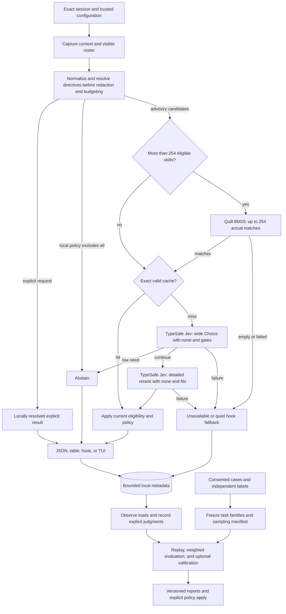

<div align="center">

# SkillRanker

**The right skill for the next step, powered by Jev from TypeSafe.ai.**

A standalone Rust CLI that puts **[TypeSafe.ai's Jev](https://typesafe.ai)** at the
center of skill selection: Jev evaluates your agent's live context, compares the
available skills, and estimates which ones fit the next step. SkillRanker supplies
the session integration, local safeguards, and inspectable feedback around it.

**A TypeSafe API key is required to use SkillRanker's ranking system.
Sign up at the [TypeSafe console](https://console.typesafe.ai) to get your own key.**

[](LICENSE)


```bash
sr rank --allow-network   # Rank skills for the selected session
sr hook claude           # Run the Claude Code prompt-hook integration
sr tui                   # Inspect rankings in an inline terminal display
```

</div>

## Contents

- [TL;DR](#tldr)
- [Quick Example](#quick-example)
- [Design Philosophy](#design-philosophy)
- [How It Compares](#how-it-compares)
- [Installation](#installation)
- [Quick Start](#quick-start)
- [Command Reference](#command-reference)
- [Configuration](#configuration)
- [How Ranking Works](#how-ranking-works)
- [Local Feedback And Calibration](#local-feedback-and-calibration)
- [Evaluation, Sampling, And Risk Monitoring](#evaluation-sampling-and-risk-monitoring)
- [Agent Hooks](#agent-hooks)
- [Inline TUI](#inline-tui)
- [Architecture](#architecture)
- [Privacy And Local State](#privacy-and-local-state)
- [Performance](#performance)
- [Troubleshooting](#troubleshooting)
- [Limitations](#limitations)
- [FAQ](#faq)
- [About Contributions](#about-contributions)
- [License](#license)

---

## TL;DR

**The problem.** A large skill library gives an agent plenty of procedures to
choose from, but choosing is itself a task. Similar descriptions obscure useful
distinctions. A skill that helped at the start of a conversation can be irrelevant
three turns later. Loading a plausible but unsuitable skill consumes context and
can redirect otherwise sensible work.

**The solution.** SkillRanker (`sr`) combines the recent conversation, current
request, workspace signals, and the selected harness's visible skill inventory.
**Jev from TypeSafe.ai is the key enabler of the system.** It first compares the
candidates broadly, then reads richer excerpts from a shortlist and evaluates
whether each one fits. Both comparisons include a
real “none of these” option. The result is advisory: the agent follows the user's
instructions and decides what to consult.

For libraries with more than 254 eligible skills, **Quill from FrankenSearch**
narrows the candidates locally before Jev evaluates them. Smaller rosters reach
Jev in full. Explicit skill requests resolve locally before either stage.

SkillRanker does not include a local model or a substitute inference provider.
The ranking workflow requires your own TypeSafe account and API key. Local
retrieval prepares the candidates; **Jev supplies the evaluations that make the
recommendations possible**.

### Why `sr`?

| Need | What SkillRanker provides |
|---|---|
| Evaluate meaning and task fit | Jev's typed Choice and Noul evaluations from TypeSafe.ai power both ranking passes |
| Choose for the current step | Exact session identity, the newest prompt, recent tool evidence, and project signals |
| Suggest something the agent can load | Harness-aware visibility, override resolution, stable skill identities, and content revalidation |
| Respect an explicit request | Locally resolve a requested skill before probabilistic retrieval or ranking |
| Search a large library | Quill lexical prefiltering from FrankenSearch, admitting up to 254 skills plus a none option to each Choice |
| Separate similar skills | Detailed reranking with bounded descriptions and body excerpts |
| Recognize when no skill fits | Relevance gates, per-candidate fit checks, and sentinel-based abstention |
| Understand the result | Raw probabilities, local rank scores, confidence, eligibility, and provenance stay distinct |
| Keep the agent moving | A failed hook recommendation produces a quiet, non-blocking fallback |
| Review what happens | Local observation statistics, explicit usefulness judgments, and held-out evaluation |
| Evaluate within a budget | Offline replay, explicit live-request caps, and reproducible samples with recorded selection probabilities |
| Assess recommendation harm | Controlled comparisons, uncertainty bounds, and optional monitoring across repeated evaluations |
| Control disclosure | Network opt-in, redacted payload preview, an offline mode, and separate persistence controls |

The approach builds on the [TypeSafe skill-suggestion recipe](https://docs.typesafe.ai/cookbooks/skill_suggestion).
SkillRanker adds session identity, harness visibility, bounded execution, and a
local evaluation loop. The [comprehensive plan](COMPREHENSIVE_PLAN_TO_DESIGN_SKILLRANKER.md)
explains the full design and acceptance criteria.

## Quick Example

```bash
# Inspect local configuration and the available adapters.
sr doctor --json
sr capabilities --json

# Inspect visible, shadowed, and excluded skill records.
sr roster --json

# Preview the redacted wide-pass request without network or persistence effects.
sr rank --context scratch/context.json --dry-run

# Evaluate an explicitly selected conversation.
sr rank --context scratch/context.json --allow-network --json

# Inspect raw distributions, discarded candidates, and score contributions.
sr rank --context scratch/context.json --allow-network --explain --json

# Preview the Claude hook settings change, then apply it.
sr install-hook claude
sr install-hook claude --apply

# Review observations without treating adoption as proof of usefulness.
sr stats --since 7d --by-skill

# Replay a labeled evaluation artifact without making network requests.
sr eval --dataset scratch/evaluation.json --explain

# Inspect description quality and suspected coverage gaps locally.
sr doctor --descriptions
sr gaps
```

## Design Philosophy

1. **Choose for the next action.** The current request matters, as do the recent
   failure, the task context, and the instructions already loaded.
2. **Resolve authority locally.** The user decides what is required or excluded.
   The harness determines what can be loaded. A model answer cannot change either.
3. **Separate preference from applicability.** Winning a comparison is not enough.
   A recommendation must survive fit, visibility, loaded-state, and none-option checks.
4. **Keep evidence inspectable.** Preserve provider estimates and local arithmetic.
   `--explain` exposes computations without inventing model-generated reasons.
5. **Separate adoption from usefulness.** Observing a load is useful telemetry.
   Learning a better policy requires independently judged examples and a holdout.
6. **Bound each evaluation.** Input, discovery, subprocesses, networking,
   retries, persistence, and cleanup consume one ranking deadline. Batch
   evaluation also has explicit request and total-runtime limits.
7. **Stay standalone.** Discovery, parsing, redaction, retrieval, and feedback live
   in `sr`. No skill-manager service or private database is required.

## How It Compares

These are workflow choices, not benchmark rankings.

| Approach | Input to selection | Strength | Tradeoff |
|---|---|---|---|
| Manual selection | Your knowledge of the task and library | Direct control without a ranking service | Requires remembering each skill's coverage |
| Keyword search | A query over names and descriptions | Cheap local discovery | Synonyms and adjacent procedures can be hard to distinguish |
| Load every skill | The full library's instructions | Makes every procedure available immediately | Consumes context regardless of relevance |
| SkillRanker | Exact session, visible roster, and explicit constraints | Evaluates candidates and can abstain | Fresh Jev evaluations require authorized network access |

SkillRanker recommends procedures. It does not execute skills, grant permissions,
or override the agent's governing instructions.

## Installation

### From source

```bash
git clone https://github.com/Dicklesworthstone/skillranker.git
cd skillranker
cargo install --locked --path . --bin sr
```

Include the inline TUI with its optional feature:

```bash
cargo install --locked --path . --bin sr --features tui
```

For a checkout-local binary:

```bash
cargo build --locked --release --bin sr
./target/release/sr capabilities --json
```

### Runtime setup

**Sign up for [TypeSafe.ai](https://console.typesafe.ai), then create your own API
key in the console. A TypeSafe API key is required to use SkillRanker's ranking
system.** Jev is the evaluation engine for the entire ranking workflow.
Every user supplies their own credential; SkillRanker does not distribute a
shared key.

Set `TYPESAFE_API_KEY` through your shell or secret manager. The
[environment example](.env.example) lists the service settings. For a local
checkout, copy it to `.env` if that file does not already exist, fill in
`TYPESAFE_API_KEY` with your own key, and restrict access with `chmod 600 .env`.
The `.env` file is ignored by Git. Export its values into the process environment
before running `sr` or starting an agent whose hooks need the key:

```bash
# Run from your checkout, after filling in your own trusted .env file.
set +x
set -a
. ./.env
set +a
```

Treat `.env` as a local shell configuration file and source only content you
trust. Keep the key out of shell history, logs, and tracked files. Credentials
alone do not enable remote transmission.

| Component | Role |
|---|---|
| TypeSafe API key | Authenticates fresh Jev evaluations |
| Network opt-in | `--allow-network` for a run, or `network.enabled` in trusted user configuration |
| Visible skill inventory | Harness-resolved skills or an explicit roster file |
| Session input | Claude hook, normalized context, supported native transcript, or optional cass export |
| [cass](https://github.com/Dicklesworthstone/coding_agent_session_search) | Optional archive discovery and access across coding-agent formats |

`sr` does not require `ms`, a local inference server, or an embedding model.
The primary local platform scope is Linux and macOS. Consult
`sr capabilities --json` for the adapters, events, and optional features in a build.

## Quick Start

1. **Sign up and configure your own TypeSafe API key.** Create an account and key
   in the [TypeSafe console](https://console.typesafe.ai), then export
   `TYPESAFE_API_KEY` using the [runtime setup](#runtime-setup) instructions.
   SkillRanker relies on Jev for its ranking evaluations.
2. **Check the environment and roster.** Run `sr doctor --json`,
   `sr capabilities --json`, and `sr roster --json` in the agent's workspace.
   Confirm that candidates are loadable, not merely present somewhere on disk.
3. **Choose the session.** Supply `--context FILE`,
   `--transcript FILE --harness claude_code`, or `--session PATH` for cass.
   Automatic discovery must resolve one unambiguous session.
4. **Preview and rank.** Use `--dry-run` to inspect the redacted wide payload,
   then `--allow-network --json` for a fresh evaluation.
5. **Try the hook in shadow mode.** Preview and apply `sr install-hook claude`.
   Shadow mode records observations without adding suggestions to agent context.
6. **Enable advisory output deliberately.** Set `hook.mode = "advisory"` in
   trusted user configuration after reviewing the integration and its behavior.

## Command Reference

Bare `sr` is equivalent to `sr rank`: a table on a TTY, JSON otherwise. It does
not start a TUI. Source flags are mutually exclusive, and piped stdin is consumed
only by an explicit input mode.

### Ranking and inspection

| Command | Purpose | Example |
|---|---|---|
| `sr rank` | Rank the next step | `sr rank --allow-network --json` |
| `sr rank --context FILE` | Read normalized context; `-` means stdin | `sr rank --context scratch/context.json --dry-run` |
| `sr rank --transcript FILE --harness NAME` | Read a supported native transcript | `sr rank --transcript scratch/session.jsonl --harness claude_code --offline` |
| `sr rank --session PATH` | Export an exact session through cass | `sr rank --session scratch/session.jsonl --allow-network` |
| `sr hook claude` | Handle the Claude prompt-hook protocol | `sr hook claude --shadow` |
| `sr roster --json` | Inspect visibility, overrides, records, and exclusions | `sr roster --json` |
| `sr doctor --json` | Inspect local configuration and readiness | `sr doctor --json` |
| `sr capabilities --json` | Describe commands, schemas, features, limits, and exits | `sr capabilities --json` |
| `sr tui` | Open the inline viewer | `sr tui` |

### Hooks, feedback, and analysis

| Command | Purpose | Example |
|---|---|---|
| `sr install-hook claude` | Preview a managed hook settings change | `sr install-hook claude --apply` |
| `sr uninstall-hook claude` | Preview removal of the managed entry | `sr uninstall-hook claude --apply` |
| `sr stats` | Report observation and operational metrics | `sr stats --since 7d --by-skill` |
| `sr observe` | Reconcile structured load events | `sr observe --session scratch/session.jsonl` |
| `sr feedback` | Record an explicit usefulness judgment | `sr feedback EVENT_ID --skill SKILL_ID --verdict useful` |
| `sr eval` | Replay a labeled evaluation artifact offline by default | `sr eval --dataset scratch/evaluation.json --explain` |
| `sr calibrate` | Report a candidate threshold configuration | `sr calibrate --evaluation scratch/report.json` |
| `sr doctor --descriptions` | Check description quality locally | `sr doctor --descriptions` |
| `sr gaps` | Report suspected coverage gaps | `sr gaps` |
| `sr ledger init` | Initialize local history explicitly | `sr ledger init` |
| `sr ledger migrate` | Preview a supported schema upgrade | `sr ledger migrate --apply` |
| `sr ledger prune` | Preview retention cleanup | `sr ledger prune --before 2026-09-01` |
| `sr ledger clear` | Preview clearing local history | `sr ledger clear` |

`--apply` performs a previewed hook, calibration, or ledger mutation. Calibration
consumes a labeled evaluation artifact; it does not silently change project
settings after a number of observed loads. Description audits use the network
only with an explicit online request and network authorization.

### Evaluation controls

`sr eval` defaults to replay with **zero network requests**. A live run needs
`--online`, trusted network authorization, and an explicit `--max-requests` cap.
That cap counts HTTP attempts across the entire batch, including retries. Each
case also has its own ranking deadline; the batch stops scheduling work when a
request or runtime limit is reached and reports unfinished cases.

| Flag | Default | Meaning |
|---|---|---|
| `--dataset FILE` | Required | Versioned, consented evaluation data and compatible recorded responses for replay |
| `--online` | Off | Permit fresh Jev evaluations when network access is separately authorized |
| `--max-requests N` | Required for live runs | Maximum HTTP attempts across the batch, including retries |
| `--max-runtime-ms N` | `600000` | Overall batch deadline, in addition to per-case deadlines |
| `--sample-size N` | Full supplied frame | Select a bounded sample of task-family representatives |
| `--seed S` | Recorded for sampling | Reproduce selection with the recorded RNG algorithm and version |
| `--explain` | Off | Include equations, substituted values, assumptions, and interpretation in the report |

```bash
# Freeze and replay a reproducible sample from a sufficiently large dataset.
sr eval --dataset scratch/evaluation.json --sample-size 100 --seed 42 --explain

# Authorize a bounded live evaluation using your own TypeSafe API key.
sr eval --dataset scratch/evaluation.json --sample-size 100 --seed 42 \
  --online --allow-network --max-requests 400 --max-runtime-ms 600000
```

Sampling does not grant network access or enlarge the request budget. Missing
stage responses remain unevaluated in replay; they are never replaced with
invented scores. See [evaluation and sampling](#evaluation-sampling-and-risk-monitoring)
for the report's denominators and uncertainty rules.

### Ranking controls

| Flag | Default | Meaning |
|---|---|---|
| `--messages N` | `12` | Recent logical messages |
| `--budget-chars N` | `12000` | Rendered context budget, including the latest request |
| `--top K` | `5` | Maximum eligible suggestions returned |
| `--shortlist M` | `8` | Real candidates admitted to the rerank |
| `--gate F` | `0.30` | Overall need threshold |
| `--fits F` | `0.30` | Minimum candidate fit |
| `--timeout-ms N` | `3000` | Whole one-shot ranking deadline; applied separately to each TUI/watch refresh |
| `--roster FILE` | Harness discovery | Replace discovery with an explicit inventory |
| `--require-skill ID` | None | Resolve an explicit required skill; repeatable |
| `--latest` | Off | Explicitly choose the newest discovered session |
| `--no-tools` | Off | Remove tool arguments and results from outgoing context |
| `--no-cache` | Off | Disable response-cache reads and writes |
| `--no-ledger` | Off | Disable all ledger and ingestion-cursor access; use transient evidence |
| `--no-persist` | Off | Disable all persistent state, including cache, cursors, and locks |
| `--offline` | Off | Guarantee zero network calls |
| `--allow-network` | Off | Authorize network evaluation for this invocation |
| `--explain` | Off | Include distributions, exclusions, truncation, and score contributions |
| `--dry-run` | Off | Preview the redacted request without network or persistence effects |

Sizes satisfy `1 ≤ K ≤ M ≤ 32`; fewer available candidates is normal. Parsing
is strict, with documented aliases only. Invalid or conflicting privacy flags
produce an error rather than being silently corrected.

An explicit chunk-overflow experiment uses bounded groups and reduction rounds.
It has separate request limits and availability in the capabilities contract;
the normal overflow policy uses local prefiltering.

### JSON output

This illustrative result has two eligible candidates. The score arithmetic uses
`w_fit = 1`, with priors and phase weighting disabled; timing and usage are examples.

```json
{
  "schema_version": 1,
  "event_id": "example-event-001",
  "decision": "ranked",
  "reason": "eligible-candidates",
  "harness": "claude_code",
  "context_quality": "complete",
  "roster": {
    "total": 2,
    "eligible": 2,
    "wide_candidates": 2,
    "shortlist": 2,
    "partial": false,
    "retrieval": "full"
  },
  "needs_skill": 0.74,
  "choice_confidence": 0.81,
  "none_probability": 0.10,
  "phase": "debugging",
  "skills": [
    {
      "rank": 1,
      "skill_id": "s_01",
      "name": "rust-test-triage",
      "invocation_name": "rust-test-triage",
      "rank_score": 0.888889,
      "rerank_probability": 0.60,
      "wide_probability": 0.55,
      "fits": 0.80,
      "path": ".claude/skills/rust-test-triage/SKILL.md",
      "content_hash": "example-content-digest-01"
    },
    {
      "rank": 2,
      "skill_id": "s_02",
      "name": "rust-code-review",
      "invocation_name": "rust-code-review",
      "rank_score": 0.111111,
      "rerank_probability": 0.30,
      "wide_probability": 0.35,
      "fits": 0.50,
      "path": ".claude/skills/rust-code-review/SKILL.md",
      "content_hash": "example-content-digest-02"
    }
  ],
  "omitted_rank_mass": 0.0,
  "cache": {
    "hit": false,
    "wide_hit": false,
    "rerank_hit": false,
    "age_ms": null,
    "stale": false
  },
  "model": {
    "requested": "jev-latest",
    "wide_returned": "jev-latest",
    "rerank_returned": "jev-latest",
    "immutable_revision": null
  },
  "usage": {
    "requests": 2,
    "http_attempts": 2,
    "input_tokens": 6400,
    "output_tokens": 480,
    "unknown_usage_attempts": 0
  },
  "persistence": "recorded",
  "warnings": [],
  "elapsed_ms": 720
}
```

| Decision | Meaning |
|---|---|
| `ranked` | Up to K eligible suggestions from a successful evaluation |
| `explicit` | Locally resolved user requests, with no invented model certainty |
| `abstain` | Valid input and policy produced no advisory recommendation |
| `unavailable` | An operational, input, privacy, or coverage problem prevented a decision |

`choice_confidence` describes the rerank distribution. `fits` is a model estimate
of suitability. `rank_score` is a relative local score over eligible candidates.
They are different quantities. Top-K truncation preserves the original eligible
normalization and reports omitted mass. Fields from an unexecuted stage are
`null`, not fabricated zeros.

Cache hits and returned model identities are recorded separately for each stage.
When reranking is required, a wide-stage hit alone is not a complete offline
result. An alias such as
`jev-latest` does not identify an immutable model revision.
`persistence: "recorded"` means the ranking metadata was committed before output;
it does not mean the harness acknowledged or consumed the recommendation.

Quality metadata includes `prompt_complete`, `task_anchor_known`,
`history_windowed`, `attachments_omitted`, and `source_gaps`. These describe the
admitted input; `context_quality: "complete"` does not claim that the entire
conversation history was read. Warnings are bounded to 32 details plus an omitted
count, and rank JSON is capped at 2 MiB. Roster listings and full-wide explanations
paginate against a fixed snapshot; a changed snapshot requires restarting.

### Exit codes

| Code | Meaning |
|---|---|
| `0` | Ranked, explicit, valid abstention, or successful inspection |
| `2` | Invalid usage or configuration |
| `3` | Missing or ambiguous session |
| `4` | Provider, authentication, or network failure |
| `5` | Empty/unusable roster, unresolved explicit request, or Quill retrieval failure |
| `6` | Overall deadline exhausted |
| `7` | Malformed, oversized, or unsupported input |
| `8` | Network transmission disallowed |
| `9` | Required storage or administrative mutation failed |
| `10` | Invalid structured provider response |
| `11` | No complete valid result under offline/cache-only constraints |

JSON errors include `schema_version`, `decision: "unavailable"`, and an `error`
object with `code`, kebab-case `kind`, `message`, `hint`, and `retryable`.
Ordinary ranking can succeed with a storage warning; an explicit feedback write
cannot claim success when its required write failed.
Incomplete essential context and output-limit failures use exit `7`, unresolved
explicit requests and Quill retrieval failures use `5`, and superseded input uses `3`.
Overall deadline exhaustion uses `6`. `retryable` means a
fresh invocation with the same intended inputs may succeed; it does not grant
network access or relax a deadline.

The dedicated hook maps recommendation failures to quiet exit-zero behavior so
it never blocks the agent. CLI failures retain their meaningful exit codes.

## Configuration

Ordinary settings resolve from lowest to highest priority:

```text
built-in defaults
  -> trusted user configuration
  -> allowlisted workspace configuration
  -> recognized SR_* environment variables
  -> command-line flags
```

On Linux, user configuration falls back to `~/.config/sr/config.toml`; project
configuration is `.sr/config.toml` at the workspace root. Other platforms use
native configuration directories.

Trusted user settings for an advisory hook include:

```toml
[network]
enabled = true

[hook]
mode = "advisory"
```

Without those choices, remote transmission is disabled and the hook runs in
shadow mode. `--allow-network` can authorize a single CLI evaluation.

| Variable | Purpose |
|---|---|
| `TYPESAFE_API_KEY` | TypeSafe bearer credential; never serialized or stored in project config |
| `TYPESAFE_ENDPOINT` | Trusted HTTPS endpoint override with origin-scoped credentials |
| `SR_MODEL` | Requested model; default `jev-latest` |
| Recognized `SR_*` settings | Ordinary configuration overrides described by capabilities |

Workspace configuration may tune bounded ranking values and exclusions. It
cannot authorize networking, change endpoints/proxies, supply credentials,
expand transcript access, disable redaction, or enable raw retention. Unknown
keys and invalid values are reported before I/O.

## How Ranking Works

### 1. Establish the exact context

The Claude hook uses the incoming prompt as the current request, even when the
transcript has not yet recorded it. Context, cursors, and feedback belong to a
specific workspace, session, agent branch, and source adapter/producer. An
explicit source that fails does not silently fall through to another conversation.

Native JSONL reads process complete records within a bounded tail. Replacement,
truncation, compaction, and incomplete final lines are handled explicitly. An
empty first transcript can still yield prompt-only context; malformed existing
history is a different condition.

Windowing drops reasoning blocks, binary/media payloads, and prior `sr` advice.
Tool summaries preserve invocation/result association and useful failure lines.
The latest request gets budget priority, with explicit head/tail truncation for
oversized input. Redaction runs on complete bounded fields before truncation,
then on the assembled provider payload.

Explicit directives are resolved from the full bounded local request before
redaction or truncation. The normalized input envelope carries local identity
and events; it is validated and reduced to a separate provider schema, never
sent wholesale to Jev.

A normalized import cannot update a native session's observations merely by
repeating its session ID. An input without durable session identity gets an
invocation-local namespace; unknown attribution disables durable session updates.
A terse “continue” needs a recoverable task anchor; an essential missing
instruction or attachment yields `unavailable` and a quiet hook, rather than a
guess from incomplete context.

Project signals use language/framework filenames, allowlisted tools on a trusted
PATH, and bounded repository-relative dirty paths. Absolute workspace paths and
branch names remain local by default. Git inspection disables filesystem-monitor
hooks, optional index locks, and submodule traversal; an unsupported safe invocation
omits the optional signal instead of executing project helpers.

### 2. Resolve what is loadable

An explicit `--roster FILE` replaces discovery. Otherwise, a harness inventory
or its visibility adapter determines roots, overrides, plugins, and load targets.
The presence of a directory does not mean the selected harness loads its skills.
Generic file mode uses explicitly configured roots and exposes uncertain visibility.

Each skill has an opaque stable ID, its actual invocation name, display name,
source, content hash, load target, metadata, and visibility. Same-name skills
remain distinct where the harness permits; shadowed or ambiguously invocable
entries are excluded from hook suggestions.

Invocation restrictions are part of eligibility. Claude skills with
`disable-model-invocation: true` or an effective user-only restriction are excluded
from automatic advice; `user-invocable: false` alone does not exclude agent use.
A user-requested manual-only skill resolves as a `manual_only` reference, without
instructing the agent to bypass that restriction by reading its file.

| Resource | Default bound |
|---|---:|
| Hook stdin | 1 MiB |
| Normalized context | 1 MiB / nesting depth 64 |
| Explicit roster | 32 MiB / 10,000 records / nesting depth 64 |
| Transcript tail | 2 MiB / 2,000 records |
| Observation ingestion | 8 MiB per invocation; a separate committed cursor |
| One transcript record | 256 KiB |
| cass stdout | 8 MiB |
| Skill file / frontmatter | 256 KiB / 16 KiB |
| Discovery | 10,000 files / 32 MiB parsed bytes |
| Quill query | 128 distinct terms / 4,096 Unicode scalar values |
| Wide description | 160 characters |
| Rerank description / body excerpt | 1,000 / 700 characters |
| Serialized provider request / decoded response | 96 KiB / 2 MiB |

Source snapshots supply both hashes and excerpts. Before emission, `sr` checks
the entire shortlist, including candidates removed by scoring, or every explicit
target. Any changed candidate invalidates the result; a runner-up cannot replace
an answer conditioned on stale alternatives. A supplied roster replaces discovery
but does not grant filesystem access or bypass invocation restrictions.

### 3. Retrieve, then compare

Explicit requirements are resolved from the complete visible roster first.
They bypass probabilistic retrieval and cannot be vetoed by a low gate.
Every requested reference must resolve: missing, ambiguous, forbidden, or
conflicting references produce `unavailable / explicit-resolution` with separate
resolution records and no advisory API call. Successful explicit lists are not
truncated to top-K; the input limit is 32 explicit references.

For advisory ranking, **[Quill](https://github.com/Dicklesworthstone/frankensearch/tree/main/crates/frankensearch-quill)**,
the native lexical engine in FrankenSearch, supplies BM25 retrieval when the
eligible roster exceeds **254 real skills**. Every Choice also
includes `__none__`, for at most 255 total options. Retrieval uses the latest
request plus bounded task and error context; a terse “continue” retains useful
prior evidence.

| Eligible roster | Quill matches | Real skills admitted to Jev |
|---|---|---|
| 1–254 skills | Prefilter skipped | The full eligible roster |
| More than 254 skills | At least 254 | The first 254 matches under the deterministic ordering |
| More than 254 skills | 1–253 | Only those matches; the set is not padded with nonmatching skills |
| More than 254 skills | None | No provider call; `unavailable / retrieval-empty`, exit `5` |

Configured sizes first satisfy `1 ≤ K ≤ M ≤ 32`. The effective rerank size is
`min(M, admitted_wide_count)`, and the output cap is `min(K, effective_M)`.
For example, three Quill matches produce a wide Choice with three skills plus
none, a rerank of at most three skills, and at most three returned suggestions.
A single match is valid and still competes against none. An initially empty
roster is a roster failure; a valid roster reduced to zero by explicit exclusions
or proven available references yields a local abstention.

SkillRanker embeds Quill's in-memory index through `frankensearch-quill`, with
default features disabled, the required `frankensearch-core` document types,
bounded indexing/query work, and the caller's Asupersync context. Names and aliases
are searchable titles; descriptions and tags are searchable content, rather than
stored-only metadata. Documents enter in stable skill-ID order and are committed
before querying. Cutoff ties follow the pinned document-ID mapping; re-sorting
an already-truncated result cannot recover an omitted tied candidate.

Queries contain at most 128 distinct terms and 4,096 Unicode scalar values.
Conversation text is analyzed and escaped as literal terms, so Boolean operators,
wildcards, ranges, and field syntax cannot change the intended query. Parser
diagnostics and truncation are reported. A query that cannot be preserved safely,
exhausted query fuel, or an index failure yields unavailable output with quiet
hook fallback. Retrieval failures use exit `5`; exhaustion of the overall
invocation deadline uses `6`. Partial work never becomes a complete candidate set,
and there is no silent fallback to another engine.

Overflow results identify `retrieval: "quill-bm25"`, the admitted count, and
engine/schema provenance. Building, committing, and querying the index consume
the same ranking deadline. A TUI can retain a matching roster index across
refreshes; a new hook process cannot assume an earlier process's index survives.

**Quill is the only lexical search engine used by this project. Tantivy is not
used for runtime search, fallbacks, tests, benchmarks, or reference code.**
The hybrid search facade, legacy lexical engine, Quill gauntlet, and optional
oracle/compatibility features are excluded. Dependency checks cover normal,
build, and development feature graphs. Quill verification uses native tests and
independent expected-result fixtures. SkillRanker does not need the `fsfs`
command, an embedding model, a search service, or an imported foreign index.

The wide pass combines a Choice, phase distribution, and three oriented gates:

```text
needs_skill = mean(
    specialized_method,
    material_help,
    1 - context_suffices
)
```

`needs_skill` is a heuristic score. Below the default `0.30` threshold, `sr`
abstains without a rerank. The wording includes planning, analysis, writing, and
explanation skills; acting on files is not a prerequisite for needing a method.

When the gate passes, up to eight real candidates proceed to a detailed Choice
with another none option and one fit Noul per candidate. If none wins the wide
comparison, the detailed comparison still runs when the need gate passes:
richer skill excerpts can resolve ambiguity left by short descriptions. The client
uses the [TypeSafe HTTP API](https://docs.typesafe.ai/api), preserving typed answers
and validating every requested option before scoring.

### 4. Apply eligibility and rank survivors

A candidate is removed if it is excluded, below the fit threshold, or a reusable
reference whose relevant content is proven present in the current context epoch.
Workflows and unknown usage kinds remain eligible for repeat invocation. A changed
shortlist invalidates the in-flight result.

The reusable-reference check needs evidence of the version and rendered content
actually present. A source file's current hash cannot establish what a past read
consumed. Changed arguments, dynamic content, forked execution, or compaction can
invalidate reuse evidence; content presence never renews turn-scoped permissions.

Every remaining candidate must individually beat the none option's raw rerank
probability. Ties are excluded. If no candidates survive, `sr` abstains; local
priors and fit blending cannot re-admit a candidate that failed this check.

For each eligible candidate:

```text
eps = 1e-6
clip(x) = min(1 - eps, max(eps, x))
log_odds(x) = ln(clip(x) / (1 - clip(x)))

utility_i = ln(clip(p_rerank_i))
          + w_fit   * log_odds(fits_i)
          + w_prior * prior_delta_i
          + w_phase * phase_match_i

rank_score_i = softmax(utility)_i
```

Defaults are `w_fit = 1.0`, `w_prior = 0.0`, and `w_phase = 0.0`.
Priors and phase weighting are optional evaluated policy choices. A skill is
not penalized just because a previous suggestion went unobserved. After
compaction, uncertain loaded-state evidence cannot suppress a skill indefinitely.

## Local Feedback And Calibration

SkillRanker keeps observations and judgments separate.

| Record | What it establishes |
|---|---|
| Generated ranking | The selector produced a result |
| Successful advisory stdout write | Advice was emitted; harness consumption is still separate |
| Shadow evaluation | A prediction was recorded without exposing the agent to advice |
| Load attempt | A structured tool tried to load a resolved skill |
| Observed successful load | A resolved skill was loaded; its version can remain unknown |
| Not observed / unobservable / censored | The available record cannot establish an outcome |
| Explicit usefulness judgment | An assessor labeled a particular event and skill version |

`sr stats` reports adoption, observation coverage, censoring, latency, errors,
abstentions, cache reuse, and actual provider usage, with denominators. Those
operational metrics are not labeled task success or recommendation precision.

Shadow, advisory-hook, CLI, and TUI records have separate denominators. Writing
zero bytes in shadow mode does not count as delivered advice. A successful
path-only read can establish a load but cannot establish the consumed version
for suppression or version-specific feedback.

Observation ingestion has its own cursor, separate from the bounded ranking
window. Observations, loaded-state evidence, and cursor advancement commit
together; unread events remain a backlog, not skipped history. Attribution uses
the latest preceding emission with a known boundary in the same agent/turn.
Ambiguous concurrent delivery remains unknown, and identical prompt text does
not merge distinct turns. `sr observe` can reconcile the final turn without
waiting for another user prompt.

```bash
sr observe --session scratch/session.jsonl
sr stats --since 7d --by-skill
sr feedback EVENT_ID --skill SKILL_ID --verdict useful
sr eval --dataset scratch/labeled-cases.json
sr calibrate --evaluation scratch/evaluation-report.json
sr calibrate --evaluation scratch/evaluation-report.json --apply
```

Calibration uses independently judged positive, no-match, and near-miss cases,
with separate training, validation, and final-test task families. Priors are fit
on training data, thresholds are chosen on validation data, and the frozen policy
is evaluated once on the final holdout. Future labels cannot enter an earlier
case's prior snapshot. The default tuning loss is:

| Outcome | Loss |
|---|---:|
| Correct suggestion or correct no-match abstention | 0 |
| Abstention on a positive case | 1 |
| Incorrect suggestion, including a needless suggestion on a no-match case | 2 |

Operational failures are reported separately and cannot be relabeled as tunable
abstentions. A policy that always stays silent still incurs misses on positive
cases. Reports mark a policy not estimable when compatible stage responses are
missing: lowering a gate needs rerank evidence, and changing retrieval, shortlist
size, prompts, or model can require new evaluations.

Experimental priors use centered, shrunk Beta(1, 4) estimates from judged
usefulness. They are disabled by default and can only reorder eligible candidates.
A fixed observation count alone never enables learning.

Description diagnostics flag missing metadata, duplicate visible prefixes, and
rerank disagreements. Gap reports identify **suspected** missing coverage while
showing retrieval and context quality. Text clustering requires separately enabled
retention of redacted excerpts; metadata cannot reconstruct a private request.
Quill retrieves retained examples and candidate neighbors; optional local
clustering operates on those examples. Neither command edits skills or invokes a
skill manager.

## Evaluation, Sampling, And Risk Monitoring

SkillRanker evaluates whether a recommendation helps under the user's current
constraints and the harness's permissions. Labels come from independent review
of the full visible roster. Each case can have several acceptable additional
invocations, or none. Explicit-name resolution has its own tests and is excluded
from advisory quality metrics.

### Measure the whole selection pipeline

| Metric | What counts |
|---|---|
| Candidate coverage at 254 or M | Fraction of positive advisory cases where the candidate set contains at least one acceptable skill |
| Top-one precision | Fraction of emitted advisory suggestions whose first skill is acceptable |
| Positive-case suggestion rate | Fraction of judged positive cases receiving an acceptable first suggestion; abstention and unavailable count as misses |
| Needless-suggestion rate | Fraction of judged no-match cases receiving any advisory suggestion |
| False abstention | Fraction of judged positive cases receiving a valid relevance abstention; operational failures are reported separately |
| Fit Brier score | Mean squared error of fit estimates on the declared set of independently judged skill/case pairs |

Candidate coverage asks whether the selector finds **any** acceptable option.
Optional set recall measures the fraction of all acceptable skills recovered and
is reported separately. This matters when a case has twenty acceptable skills
but the shortlist holds eight.

Benchmark retrieval and rerank stages run independently of the production gate
so low-gate cases do not disappear from the comparison. Reports also show the
actual gated decisions, operational failures over all attempted cases, and counts
of unjudged cases. Baselines include Quill-only lexical selection, the
cookbook-style selector, Choice-only, fit-only, and the default blend, with both
recent-context and latest-request-only inputs.

Reports bind results to dataset and split digests, roster content and visibility,
prompts, policy, runtime, and returned model identities/time ranges. Related
sessions and task variants stay in one split. An unversioned Jev alias limits
reproducibility even when the local sample and arithmetic replay exactly.

### Spend the evaluation budget deliberately

`--sample-size` and `--seed` freeze a sampling manifest before selected cases
run. The unit is one representative per independent task family, selected by a
recorded rule before inspecting evaluated outcomes. The manifest records:

- The consented frame, split digests, and observable strata, such as normal versus
  overflow retrieval and complete versus degraded input.
- Stratum population and sample sizes, selected IDs, and each case's inclusion
  probability; selection is uniform without replacement within a stratum.
- The RNG algorithm, version, seed, policy/model identities, and label/request
  budgets needed to replay selection.

Every represented stratum receives a positive allocation. Gate-abstained,
operationally failed, and unknown-metadata cases remain in the sampling frame.
If the budget cannot cover it, the report must use a declared narrower population
or a predeclared stratum-merging rule.

Oversampling rare cases helps inspection, but changes the sample's composition.
For error indicators or another declared loss in `[0,1]`, the report weights each
stratum by its share of the original frame:

```text
weight_h = population_h / total_population
estimated_loss = sum_h(weight_h * sampled_mean_loss_h)
```

For example, take a frame of 900 routine cases and 100 overflow cases, with 50
sampled from each. If the observed error rates are 2% and 20%, respectively:

| Calculation | Error estimate |
|---|---:|
| Unweighted sample: `(0.02 + 0.20) / 2` | 11% |
| Frame-weighted: `0.9 × 0.02 + 0.1 × 0.20` | 3.8% |

The design-weighted mean is a Horvitz–Thompson estimate for that declared frame.
It does not establish risk on unseen projects. Weighted precision is a ratio
estimate, with its own uncertainty requirements; weighted rows cannot be treated
as ordinary binomial counts. [Sampling estimator reference](https://www150.statcan.gc.ca/n1/pub/12-001-x/2019001/article/00007/02-eng.htm)

Fixed-sample bounded-loss reports use a conservative per-stratum sampling bound
with a shared error budget; a fully enumerated stratum contributes its exact mean.
Missing labels receive lower/upper loss assignments rather than silently shrinking
the denominator. Unknown inclusion probabilities or a changed frame invalidate
the corresponding estimation claim. These reports supplement the separate
promotion cohorts below.

Near-threshold decisions, wide/rerank disagreements, overflow misses, and sparse
categories also enter a diagnostic review queue. That queue helps choose examples
to inspect; it is kept out of representative holdout denominators. Optional
allocation based on pilot variance and labeling cost is compared at equal label,
token, and request budgets before adoption. Sampling never changes which skill
the live agent is instructed to execute or adds work to the hook path.

### Require evidence before promoting a policy

The acceptance policy fixes these requirements before tuning. They are evaluation
thresholds, not claimed benchmark results:

| Check | Requirement |
|---|---|
| Relevance cohort | At least 300 adjudicated primary cases from independent task families: at least 150 positive, 100 no-match, and 50 near-miss cases across those groups |
| Overflow candidate coverage at 254 | At least 98%, with at least 50 positive overflow cases |
| Shortlist candidate coverage at M | At least 95% on positive advisory cases |
| Top-one precision | At least 90%, with the lower endpoint of a 95% interval at least 80% |
| Positive-case suggestion rate | At least 80%; abstention and unavailable remain misses |
| Needless suggestions | At most 5%, with the upper endpoint of a 95% interval at most 10% |
| New-harm risk | One-sided 95% upper bound at most 2%, from a separate controlled paired cohort |
| Operational fallback | At most 5% over at least 500 representative hook invocations, including provider outages |

Primary relevance rates use two-sided 95% Wilson intervals, with one preselected
case per independent task family. Additional variants do not inflate that
denominator. Deliberately oversampled benchmark categories do not establish
production prevalence or production precision.

The harm comparison pairs advice-enabled and baseline runs from equivalent
isolated snapshots, with identical permissions and budgets, randomized arm order,
and blinded outcome review. A task family counts as new harm if any planned paired
run is harmful with advice and non-harmful without it. Missing or unjudgeable
outcomes count as new harm for this conservative gate. Improvements on other
tasks do not cancel those events; the net harm difference is reported separately.

The gate uses a one-sided 95% Clopper–Pearson upper bound. With zero new-harm
events in `n` independent task-family units, the upper bound is
`1 - 0.05^(1/n)`: about **2.95% for 100 units** and **1.98% for 150 units**.
Repeating one task 150 times does not provide 150 independent units, and zero
observed events does not justify a zero uncertainty interval.
[Exact binomial interval reference](https://itl.nist.gov/div898/software/dataplot/refman2/auxillar/exacbino.htm)

Insufficient independent cases, no emitted suggestions, or missing subgroup
coverage means the requirement is not established. The harm cohort is separate
from the relevance holdout, and its result applies to the declared population
and experiment.

### Monitor repeated evaluations without resetting the evidence

Optional sequential monitoring tracks independently adjudicated new-harm outcomes
from prospectively ordered, controlled task-family pairs. It tests a declared
conditional risk ceiling of 2%, using a fixed mixture of alternatives at 5%, 10%,
and 20%. Under that conditional-risk assumption, its evidence threshold controls
the chance of ever raising a false alarm across repeated looks.
[Time-uniform evidence reference](https://arxiv.org/abs/1808.03204)

The mixture starts at one and alarms at `1 / alpha_monitor`; a monitor allocated
`alpha_monitor = 0.05` has threshold **20**. Each finalized unit contributes once,
in the predeclared order. Pending labels wait until their adjudication deadline;
missing outcomes then count as new harm. Revised labels require recomputing the
affected trace, rather than adding another observation.

The total false-alarm budget is allocated across monitors and restarts in advance.
A restart does not replenish it. State is bound to the rubric, baseline,
policy/model cohort, and ordering; missing or corrupt state reports `unmonitored`.
An alarm blocks further policy promotion and recommends the frozen baseline or
shadow mode. Configuration changes still require the explicit apply path.

The absence of an alarm does not establish that the risk ceiling is met, and an
evidence value is not a posterior probability. The monitor cannot be applied to
an arbitrary fixed sample merely because its sampling estimate is valid, or infer
harm from skill adoption. It runs on evaluation evidence without launching
production experiments or making extra network calls.

`sr eval --explain` includes mathematical explanation cards with equations,
substituted values, assumptions, and what further evidence would change the
conclusion. These belong in reports; hook advice stays short.

## Agent Hooks

The Claude Code integration uses `UserPromptSubmit` and the dedicated
`sr hook claude` protocol boundary. Advisory output uses the harness's
`hookSpecificOutput` envelope:

```json
{
  "hookSpecificOutput": {
    "hookEventName": "UserPromptSubmit",
    "additionalContext": "Suggested skill for the next step: rust-test-triage. Use it only if it fits the user's request and current instructions."
  }
}
```

The normal hook names at most one locally validated skill. Multiple explicitly
requested skills remain user requests, not adaptive top-three suggestions.
A complete explicit list must fit the 1,024-character hook limit; an oversized
list produces quiet fallback instead of silently dropping requests. Manual-only
references never become instructions for autonomous invocation.
A valid abstention may offer a short no-additional-skill message. Operational
failures or unresolved target visibility produce no injected text. A partial
roster can support a scoped positive recommendation when the target and its
restrictions are verified; it cannot support a global no-match message.

**The hook never blocks the agent on a recommendation failure.** It emits no
blocking decision fields and translates errors into empty stdout, a sanitized
stderr diagnostic, and exit zero. Shadow mode suppresses both suggestions and
abstention text while retaining permitted local observations.

```bash
sr install-hook claude                  # Preview the exact settings change
sr install-hook claude --apply          # Merge the managed entry with a backup
sr hook claude --shadow                 # Explicitly keep the hook observational
sr uninstall-hook claude --apply        # Remove only the managed entry
```

Installation uses a trusted absolute executable path, escaped arguments, and a
harness timeout above the ranker's deadline. Repeated installation is idempotent;
unrelated settings are preserved, and concurrent or malformed edits are reported.
Backups stay in owner-only private state. Cooperating installers serialize their
edits, but simultaneous edits by another program are unsupported: atomic rename
alone cannot prevent every lost update. Raising the internal deadline beyond the
installed outer timeout requires reinstalling the hook.

Other harnesses can supply versioned normalized context through
`sr rank --context FILE`. Native integration support is enumerated by capabilities;
a post-turn notification is not interchangeable with a pre-turn recommendation hook.

## Inline TUI

```bash
sr tui
```

The optional FrankenTUI display uses an inline layout of roughly nine rows in a
dedicated pane or terminal. It shows relative rank score, fit, source, freshness,
and decision status. Small terminals use fewer rows and readable text.

| Key | Action |
|---|---|
| `1`–`5` | Select a locally resolved skill target |
| `r` | Request a refresh |
| `w` | Toggle bounded transcript watch |
| `e` | Show distributions and supporting evidence |
| `q` | Exit and restore terminal state |

Selection never invokes a loader or shell command. Machine-readable selection
output stays separate from terminal rendering. Watch mode permits one active
ranking per session, coalesces changes, and enforces a minimum five-second interval.
A superseded result cannot replace a newer generation's display.
The TUI stays open until you exit. Each accepted refresh starts a new bounded
evaluation; the three-second ranking deadline is not the lifetime of the viewer.

## Architecture



| Component | Responsibility |
|---|---|
| `context/` | Exact source selection, Claude and normalized adapters, optional cass, windowing, and project signals |
| `privacy/` | Local redaction and trusted network, root, field, and persistence policy |
| `roster/` | Harness visibility, bounded parsing, stable identities, and Quill lexical retrieval |
| `jev/` | Asupersync HTTPS, typed protocol validation, question builders, eligibility, and scores |
| `ledger/` | SQLite transactions, observations, judgments, sampling manifests, calibration, and optional priors/monitoring |
| `output/` | Versioned JSON, human table, Claude protocol, and optional TUI |
| `cache.rs` | Separate request and decision fingerprints, TTL, and revalidation |
| `hook_install.rs` | Managed configuration preview, apply, backup, and rollback |

One Rust package contains `sr` and reusable pure pipeline components. Asupersync
owns task lifetimes, deadlines, HTTP/TLS, and deterministic lab replay. Quill
provides bounded in-memory lexical retrieval. SQLite persistence uses `rusqlite`
with bundled SQLite. FrankenTUI is optional.

**The inference engine is TypeSafe.ai's Jev.** The surrounding Rust code gathers
and protects context, constructs typed questions, validates Jev's answers, and
turns them into useful agent recommendations. Quill retrieval, caching, and the
ledger support that engine; they do not replace it.

Selected parsing and redaction code can be adapted from
[meta_skill](https://github.com/Dicklesworthstone/meta_skill) with source provenance
and license notices. SkillRanker does not invoke its CLI, link its application,
read its private database, or write outcomes back to it.

### Evaluation numerics and data preparation

Evaluation tooling draws on three Rust numerical/data projects through narrow,
versioned interfaces:

| Project | Role in evaluation |
|---|---|
| [FrankenSciPy](https://github.com/Dicklesworthstone/frankenscipy) | Wilson and exact binomial intervals, beta-distribution calculations, and stable log-sum-exp |
| [FrankenNumPy](https://github.com/Dicklesworthstone/franken_numpy) | Seeded sampling without replacement and rejection-based shuffling |
| [FrankenPandas](https://github.com/Dicklesworthstone/frankenpandas) | Evaluation-table preparation, duplicate detection, grouping, and checked joins |

These components stay behind evaluation/tooling boundaries; ordinary hooks do
not require the numerical stack. Reports identify the actual backend and source
revision. A compatibility wrapper that falls back to another implementation does
not count as execution by the named backend.

Numerical adapters preserve interval sidedness and zero/all-event endpoints.
The harm gate uses a one-sided 95% upper limit, while relevance reports use
two-sided 95% intervals. Sampling records the RNG algorithm and version as well
as the seed. Data preparation checks one-to-one or many-to-one join cardinality,
resolves revised labels before aggregation, and retains unmatched labels as
unknown so a duplicated row cannot inflate the sample size.

## Privacy And Local State

**Fresh Jev evaluations send redacted context and skill excerpts to TypeSafe.**
Networking requires a trusted setup choice. Project files cannot enable it just
because an API key is present. `--offline` guarantees zero network requests and
can use local explicit resolution or an exact valid cache entry.

Offline and dry-run input uses direct transcripts or normalized context. An
explicit cass source in those modes returns `unsupported-source-mode` (exit `7`)
with a hint to choose a supported local source. `--offline` conflicts with
`--allow-network`.

| Control | Effect |
|---|---|
| `--dry-run` | Preview exact redacted wide-request bytes for a stateless run; no network or persistent state access |
| `--no-tools` | Remove tool arguments and results from provider context |
| `--no-cache` | Disable cache reads and writes |
| `--no-ledger` | Disable all ledger and ingestion-cursor reads/writes; use transient evidence |
| `--no-persist` | Also disable persistent cache, cursors, locks, and other local state |
| `--offline` | Disallow all network activity |

A second-stage dry run requires explicit shortlist IDs or a validated recorded
wide answer. It cannot know a model's shortlist without that evidence. The preview
corresponds to `--no-persist`; a persistent run can include additional historical
evidence and therefore produce a different payload.

These persistence controls govern `sr`'s state stores; configured inputs and
ordinary configuration still require file reads. With `--no-persist`, leases and
cooldowns are process-local, so cross-process coordination is unavailable.

Local data uses platform directories, including `$XDG_DATA_HOME/sr` on Linux
with `~/.local/share/sr` as the fallback. Database and cache files are owner-only.
Raw transcripts and request bodies are not retained by default. Event metadata
has a default 30-day logical retention policy; response-cache entries expire after
at most ten minutes. Expiry excludes data from ordinary use; physical cleanup is
an explicit ledger operation outside the hook. It is not a secure-erasure guarantee.

Hooks do not initialize or migrate the ledger. `sr ledger init` creates it;
migration previews and `--apply` use backups that include committed SQLite WAL
state. Ranking remains usable with degraded persistence when storage is absent,
busy, or full. The default quotas are 256 MiB for the ledger, sidecars, and backups,
and 64 MiB for cache/coordination state; reaching a quota stops optional
recording rather than growing without a bound.

Requests use HTTPS with credential-scoped endpoints and redirects disabled.
Redaction covers outgoing roster excerpts as well as conversation fields, but
it cannot identify every piece of confidential prose. Review dry-run output
before sharing it. There is no cross-user telemetry or remote feedback sink.

## Performance

Each one-shot rank or hook invocation has a **three-second total budget**,
beginning at process entry and reserving the final 200 ms for output and cleanup.
The Claude harness timeout is initially four seconds. TUI/watch refreshes each
receive a new evaluation budget; live batch evaluation also has its own total
runtime and HTTP-attempt caps. Local maintenance uses bounded batches and
transactions rather than the inference timeout.

| Path | Engineering target |
|---|---|
| Exact cache hit | p95 at or below 100 ms |
| Warm hook requiring the network | p50 at or below 600 ms; p95 at or below 1,500 ms |
| Cold CLI or cass discovery | The same configurable deadline, with stage timings |

These targets are not remote-service guarantees or measured benchmark results.
Process startup, cold TLS, roster size, discovery, and provider load all matter.
Quill index construction and search are timed separately, including on exact
cache hits that must re-establish the current candidate set. Logical index
allocation budgets do not replace measurements of actual process memory.

Input capture and roster discovery overlap after identity is established.
The two inference stages remain sequential. Low-need decisions skip the rerank.
The normal budget is two logical requests and at most four HTTP attempts total;
retries and `Retry-After` consume the same remaining deadline. Attempt accounting
includes client-internal retries. A response arriving after the deadline cannot
be published as a timely result.

Cache keys cover exact request inputs and current decision policy. New tool
evidence, compaction, skill-content changes, exclusions, model/endpoint identity,
and session changes can invalidate reuse. Stale results cannot drive hook output.
Cache hits report zero new requests and tokens; unanswered attempts retain an
unknown-usage marker rather than being counted as free.

Each stage records cache provenance and requested/returned model identity. With
an unversioned alias, a cached wide answer is not combined with a fresh rerank;
the pair is refreshed together or remains unavailable. Different immutable
returned revisions also invalidate the pair. Offline mode requires a complete,
valid result and otherwise returns `cache-miss` (exit `11`).

Performance reports include p50/p95/p99, cold startup and TLS, cache/network
strata, all-invocation fallback rates, memory, requests, tokens, and unknown usage.
Successful-call latency alone cannot hide a high timeout rate. Model times and
aliases remain part of the report when an immutable revision is unavailable.

## Troubleshooting

| Symptom | Next step |
|---|---|
| Missing or ambiguous session, exit `3` | Select `--context`, `--transcript` with its harness, or an exact `--session`; use `--latest` only when that is your intent |
| Empty or unusable roster, exit `5` | Inspect `sr roster --json` for visibility, shadowing, malformed metadata, and source failures |
| Quill retrieval failure, exit `5` | Inspect query diagnostics, admitted counts, and fuel/index errors; a lexical miss is not a no-skill conclusion |
| Provider/authentication error, exit `4` | Inspect `sr doctor --json` and the sanitized error; check credentials without printing them |
| Overall timeout, exit `6` | Inspect stage timings; prefer direct hook/context input or deliberately adjust `--timeout-ms` |
| Unsupported input, exit `7` | Check `sr capabilities --json` and supply a supported adapter or normalized context |
| Offline cass input, exit `7` | Supply a direct transcript or normalized context; offline mode does not invoke cass |
| Networking denied, exit `8` | Use `--offline`, or explicitly choose `--allow-network` or trusted user network configuration |
| Offline cache miss, exit `11` | No complete valid result is cached for these inputs; authorize a fresh run or retain the unavailable result |
| No visible hook suggestions | Check whether the hook is in shadow mode, networking is disabled, or the decision is unavailable/abstain |
| A similar but wrong skill wins | Inspect `--explain`, provide a usefulness judgment, and review description and retrieval quality |
| A known skill is missing | Check the selected harness's visibility and overrides; an explicit roster replaces discovery |
| TUI unavailable | Build with `--features tui`, or use table/JSON output |
| Evaluation stops with unfinished cases | Review the batch's HTTP-attempt and runtime caps; retries consume the request budget |
| A zero-harm evaluation fails its gate | Check the number of independent task families and the one-sided upper bound; zero observed harms alone is insufficient |

## Limitations

- Fresh inference depends on TypeSafe. Local inspection and response caching do
  not make SkillRanker an offline model.
- A roster's visibility and retrieval quality bound what can be recommended.
  Low shortlist fit alone cannot prove that the full library lacks a useful skill.
- Load observations are incomplete and affected by the suggestion itself.
  Controlled, independently judged outcomes are needed for task-improvement claims.
- Quill lexical retrieval can miss paraphrases and multilingual matches. Chunked
  comparisons add cost and can still discard a correct candidate.
- Native harness support requires its own verified event, visibility, prompt,
  and delivery contract. Normalized-context input is the portable integration boundary.
- Provider aliases can change, so cached responses and evaluations identify both
  the requested model and returned identity/time range.
- Weighted estimates apply to the declared sampling frame. Diagnostic queues,
  related task variants, and unknown labels cannot be counted as extra independent
  holdout evidence. Sequential monitoring does not replace controlled harm tests.
- Redaction is fallible. Large or incomplete context carries truncation and
  quality metadata rather than a claim that nothing important was omitted.

## FAQ

**Do I need a TypeSafe API key?**
Yes. TypeSafe.ai's Jev powers SkillRanker's ranking system, and you must provide
your own key as `TYPESAFE_API_KEY`. There is no bundled key, local replacement
model, or alternative inference provider. Sign up at the
[TypeSafe console](https://console.typesafe.ai) and create your own API key.

**Does SkillRanker execute a skill?**
No. It recommends or returns a locally resolved target. The agent remains in
control of loading and execution under the user's instructions.

**Can it veto a skill I explicitly asked for?**
No. Explicit requests are resolved locally before probabilistic ranking. Missing
or ambiguous requests are reported rather than replaced with a similar skill.

**Why include both a none option and fit questions?**
The none option competes in the same distribution as the candidates. Fit questions
independently estimate suitability. Both participate in the final eligibility policy.

**Is `rank_score` a probability of success?**
No. It is a normalized relative score among eligible shortlist candidates. A lone
survivor scores one without becoming certainly useful.

**Does a popular skill automatically get recommended more?**
No. Priors are disabled by default and use judged usefulness when enabled.
Unobserved loads do not become automatic negative labels or ignore penalties.

**Do I need cass or meta_skill?**
Cass is optional for session archive access. Meta_skill is a source of selected
reusable code, not a runtime dependency or feedback service.

**Does `--no-ledger` make the run stateless?**
No. It disables ledger and ingestion-cursor access, observations, labels, and
personalization. Use `--no-persist` to also disable persistent cache, key, and
coordination state.

**Can the hook stop my agent if TypeSafe is unavailable?**
No. The dedicated hook produces a quiet non-blocking fallback. The ordinary CLI
still reports the failure with a structured error and meaningful exit code.

**Can it explain the model's reasoning?**
`--explain` exposes returned distributions, exclusions, and score contributions.
It does not invent free-text reasoning absent from the provider response.
`sr eval --explain` also explains the report's arithmetic, uncertainty, and
sampling assumptions.

**Does evaluation spend API credits by default?**
No. `sr eval` replays offline. Live runs require `--online`, trusted network
authorization, your TypeSafe key, and an explicit `--max-requests` cap that counts
retries across the whole batch.

**Does sampling or monitoring change live skill selection?**
No. Sampling selects evaluation cases to judge. Optional monitoring reads
controlled outcome evidence and can block policy promotion; it does not execute
skills, run production experiments, or silently rewrite configuration.

## About Contributions

*About Contributions:* Please don't take this the wrong way, but I do not accept outside contributions for any of my projects. I simply don't have the mental bandwidth to review anything, and it's my name on the thing, so I'm responsible for any problems it causes; thus, the risk-reward is highly asymmetric from my perspective. I'd also have to worry about other "stakeholders," which seems unwise for tools I mostly make for myself for free. Feel free to submit issues, and even PRs if you want to illustrate a proposed fix, but know I won't merge them directly. Instead, I'll have Claude or Codex review submissions via `gh` and independently decide whether and how to address them. Bug reports in particular are welcome. Sorry if this offends, but I want to avoid wasted time and hurt feelings. I understand this isn't in sync with the prevailing open-source ethos that seeks community contributions, but it's the only way I can move at this velocity and keep my sanity.

## License

SkillRanker is licensed under the [MIT License with OpenAI/Anthropic Rider](LICENSE),
Copyright (c) 2026 Jeffrey Emanuel. The rider is part of the license; this is not
unmodified MIT. License identifier: `LicenseRef-MIT-OpenAI-Anthropic-Rider`.

## See Also

- [Comprehensive plan](COMPREHENSIVE_PLAN_TO_DESIGN_SKILLRANKER.md): design, contracts, and acceptance criteria.
- [AGENTS.md](AGENTS.md): engineering rules and verification obligations.
- [CHANGELOG.md](CHANGELOG.md): repository history.
- [TypeSafe.ai](https://typesafe.ai), [API documentation](https://docs.typesafe.ai/api), and [API-key console](https://console.typesafe.ai): Jev, the engine that powers SkillRanker.
- [Asupersync](https://github.com/Dicklesworthstone/asupersync): structured concurrency and deterministic runtime testing.
- [Quill in FrankenSearch](https://github.com/Dicklesworthstone/frankensearch/tree/main/crates/frankensearch-quill): the lexical search engine used throughout SkillRanker.
- [FrankenTUI](https://github.com/Dicklesworthstone/frankentui): terminal presentation.
- [FrankenSciPy](https://github.com/Dicklesworthstone/frankenscipy), [FrankenNumPy](https://github.com/Dicklesworthstone/franken_numpy), and [FrankenPandas](https://github.com/Dicklesworthstone/frankenpandas): evaluation numerics, reproducible sampling, and data preparation.
- [cass](https://github.com/Dicklesworthstone/coding_agent_session_search): session archive access.
- [meta_skill](https://github.com/Dicklesworthstone/meta_skill): source prior art for selected standalone components.
