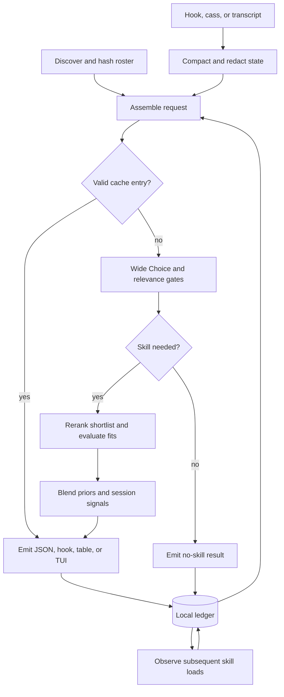

<div align="center">

# SkillRanker

**The right skill for the next step.**

A Rust CLI that ranks the skills your coding agent should load next, using the
live conversation, the workspace, and a local history of what actually helped
the agent choose.

[](LICENSE)


```bash
sr                       # Rank skills for the current session
sr --hook --format hook  # Feed a short recommendation into an agent hook
sr tui                   # Inspect the ranking in an inline terminal UI
```

</div>

## Contents

- [TL;DR](#tldr)
- [Quick Example](#quick-example)
- [Design Philosophy](#design-philosophy)
- [How It Compares](#how-it-compares)
- [Installation](#installation)
- [Quick Start](#quick-start)
- [Command Reference](#command-reference)
- [Configuration](#configuration)
- [How Ranking Works](#how-ranking-works)
- [Learning From Each Turn](#learning-from-each-turn)
- [Agent Hooks](#agent-hooks)
- [Inline TUI](#inline-tui)
- [Architecture](#architecture)
- [Privacy And Local State](#privacy-and-local-state)
- [Performance](#performance)
- [Troubleshooting](#troubleshooting)
- [Limitations](#limitations)
- [FAQ](#faq)
- [About Contributions](#about-contributions)
- [License](#license)

---

## TL;DR

**The problem.** A large skill library gives an agent plenty of procedures to
choose from, but choosing is itself a task. Short descriptions can hide the
difference between two similar skills. A skill that was useful at the start of
a conversation can be irrelevant three turns later. Loading the wrong one costs
context and can steer otherwise sensible work off course.

**The solution.** SkillRanker (`sr`) reads the recent conversation, discovers the
skills visible from the workspace, and asks TypeSafe's Jev to evaluate the next
step. A wide pass finds candidates; a second pass reads richer descriptions and
checks whether each candidate actually fits. A local ledger records suggestions
and subsequent skill loads, refining the priors and exposing gaps in the roster.

### Why `sr`?

| Need | What SkillRanker provides |
|---|---|
| Choose for the current step | Recent messages, tool summaries, project signals, and session history contribute to the ranking |
| Search a large skill library | Up to 255 skills per wide pass; lexical prefiltering or parallel chunks handle larger rosters |
| Separate similar skills | The rerank uses full descriptions and the opening text of each shortlisted `SKILL.md` |
| Recognize when no skill applies | Independent relevance gates and per-skill fit estimates can suppress a recommendation |
| Avoid repeated suggestions | Loaded skills and repeatedly ignored suggestions receive session-specific demotions |
| Understand the result | Raw probabilities, fit estimates, blended scores, and distribution confidence remain separate |
| Integrate with an agent | Hook output is short; JSON is structured; stdout stays free of diagnostics |
| Improve the roster | Confusion reports identify indistinct descriptions; coverage reports identify missing procedures |
| Keep learning local | Calibration and usage history live in a local SQLite ledger; there is no cross-user telemetry |

SkillRanker builds on the [TypeSafe skill-suggestion recipe](https://docs.typesafe.ai/cookbooks/skill_suggestion).
Its additions are session context, a persistent feedback loop, and an optional
bridge to [meta_skill](https://github.com/Dicklesworthstone/meta_skill).
The [comprehensive plan](COMPREHENSIVE_PLAN_TO_DESIGN_SKILLRANKER.md) contains the
full question design and engineering rationale.

## Quick Example

```bash
# Inspect everything this workspace makes available.
sr roster --json

# Inspect the redacted request without making an API call.
sr rank --dry-run

# Rank for the next step of your current agent session.
sr rank --json

# Use a particular transcript instead of automatic session discovery.
sr rank --transcript ./scratch/session.jsonl --messages 12 --top 5 --json

# Inspect gates, the wide distribution, and each score contribution.
sr rank --explain --json

# Connect the ranker to Claude Code's prompt hook.
sr install-hook claude

# See which suggestions the agent actually followed.
sr stats --since 7d --by-skill

# Find confusing descriptions and missing skills.
sr doctor --descriptions
sr gaps
```

## Design Philosophy

1. **Choose for the next action.** The latest request matters, but so do the
   tool failure just above it, the project language, and the skills already in
   context. Rank against that combined state.
2. **Separate preference from applicability.** A forced choice always has a
   winner. Independent fit questions tell us whether that winner belongs in
   the conversation at all.
3. **Keep the evidence visible.** Preserve Jev's probabilities and confidence
   alongside the local score. `--explain` exposes the arithmetic and gates;
   it does not invent a prose explanation from the model.
4. **Learn from observable behavior.** Use subsequent skill loads as feedback,
   while keeping the distinction between a load and a successful outcome.
5. **Make a hook cheap to run.** Compact context, bounded requests, caching,
   and structured cancellation keep the work contained within a turn.
6. **Reuse the ecosystem's strengths.** `cass` handles session access,
   Asupersync handles concurrency, FrankenTUI handles the terminal, and
   meta_skill can supply the roster and consume outcomes.

## How It Compares

These are workflow choices, not benchmark rankings.

| Approach | Input to selection | Strength | Tradeoff |
|---|---|---|---|
| Manual selection | Your knowledge of the task and library | Direct control with no ranking service | Requires remembering what each skill covers |
| Keyword search | A query over skill names and descriptions | Cheap, local candidate discovery | Synonyms and closely related procedures can be difficult to separate |
| Load the whole library | Every skill's full instructions | Makes all procedures available immediately | Consumes context even when most procedures are irrelevant |
| SkillRanker | Live session, workspace, roster, and local feedback | Ranks candidates and separately tests whether they fit | Fresh Jev evaluations require a network call and API credentials |

`sr` complements a skill manager. It chooses what to consult; the agent remains
responsible for reading the chosen skill and following the user's instructions.

## Installation

### From source

```bash
git clone https://github.com/Dicklesworthstone/skillranker.git
cd skillranker
cargo install --locked --path . --bin sr
```

Include the inline TUI with the `tui` feature:

```bash
cargo install --locked --path . --bin sr --features tui
```

For a checkout-local binary:

```bash
cargo build --locked --release --bin sr
./target/release/sr capabilities --json
```

### Runtime setup

Set `TYPESAFE_API_KEY` through your shell or secret manager. SkillRanker reads it
from the environment; keep it out of project configuration and Git.

| Component | Role |
|---|---|
| TypeSafe API key | Authenticates fresh Jev evaluations |
| Local `SKILL.md` files | Supply the procedures available to the agent |
| [cass](https://github.com/Dicklesworthstone/coding_agent_session_search) | Discovers and exports sessions across agent harnesses; optional with explicit transcript input |
| [meta_skill](https://github.com/Dicklesworthstone/meta_skill) (`ms`) | Optional indexed roster, search, and feedback integration |

There is no embedding model or local inference server to download for ranking.

## Quick Start

1. **Check the environment.** Run `sr doctor` to inspect credentials and the
   available session and roster integrations.
2. **Inspect the roster.** Run `sr roster --json` from the project where your
   agent is working. Confirm that names, descriptions, and paths are useful.
3. **Inspect the payload.** Run `sr --dry-run` to review the redacted context and
   wide-pass questions before sending anything.
4. **Get a ranking.** Run `sr --json`, or use `--transcript PATH` to choose an
   exact conversation.
5. **Wire the hook.** Run `sr install-hook claude`, `sr install-hook codex`, or
   `sr install-hook omp` for the corresponding harness integration.
6. **Review behavior.** Use `sr stats --since 7d --by-skill` before changing
   thresholds. Use `sr calibrate` once enough labeled turns have accumulated.

## Command Reference

Bare `sr` is equivalent to `sr rank`. On a TTY, it prints a compact table;
otherwise, JSON is the default. The interactive TUI requires `sr tui` or `--tui`.

| Command | Purpose | Example |
|---|---|---|
| `sr rank` | Rank for the next step | `sr rank --json` |
| `sr --hook --format hook` | Read a harness hook payload from stdin and emit recommendation context | `sr --hook --format hook < scratch/hook.json` |
| `sr tui` | Open the inline ranking display | `sr tui --messages 12` |
| `sr roster` | Inspect the discovered skill records | `sr roster --json` |
| `sr stats` | Report suggestion and observed-load metrics | `sr stats --since 7d --by-skill` |
| `sr calibrate` | Fit gate and fit thresholds from labeled history | `sr calibrate` |
| `sr doctor` | Inspect environment and integrations | `sr doctor` |
| `sr doctor --descriptions` | Analyze confused skill pairs and description quality | `sr doctor --descriptions` |
| `sr gaps` | Group requests for which no skill fit | `sr gaps` |
| `sr install-hook <harness>` | Install the harness integration | `sr install-hook claude` |
| `sr capabilities --json` | Print the machine-readable command contract | `sr capabilities --json` |

### Ranking controls

| Flag | Default | Meaning |
|---|---|---|
| `--messages N` | `12` | Number of recent messages to consider |
| `--budget CHARS` | `12000` | Context compaction budget; the latest request is preserved |
| `--top K` | `5` | Maximum number of ranked skills to return |
| `--shortlist M` | `8` | Candidates carried from the wide pass to the rerank |
| `--gate F` | `0.30` | Minimum overall need for a skill before reranking |
| `--fits F` | `0.30` | Minimum fit before a candidate is marked weak |
| `--overflow prefilter\|chunk` | `prefilter` | Strategy for rosters larger than 255 entries |
| `--timeout MS` | `3000` | Jev-stage deadline, including retries |
| `--hook-top N` | `1` | Hook recommendation count; the adaptive policy can name three when the leading scores are close |
| `--transcript PATH` | Automatic | Read a specific transcript |
| `--roster PATH` | Discovered sources | Supply a roster JSON file |
| `--json` | Automatic off-TTY | Emit structured JSON |
| `--format hook` | Off | Emit the short recommendation block |
| `--tui` | Off | Use the inline terminal display |
| `--no-cache` | Off | Bypass ranking reuse |
| `--no-ledger` | Off | Disable ledger participation for this invocation |
| `--no-tools` | Off | Omit tool results from the outgoing context |
| `--explain` | Off | Include gates, distributions, and score contributions |
| `--dry-run` | Off | Inspect redacted request payloads without sending them |

An explicit `--hook-top 1` keeps hook output to one skill. Without an explicit
override, the adaptive policy can expand to three when the top two scores are
within `0.10`. Ranking output still defaults to five candidates.

Common argument variations, such as `--top_k` for `--top`, are normalized with a
note on stderr. Machine output stays parseable.

### JSON output

Illustrative result for a roster with two shortlisted skills:

```json
{
  "harness": "claude_code",
  "workspace": "/work/example",
  "needs_skill": 0.74,
  "confidence": 0.81,
  "phase": "debugging",
  "stuck": 0.62,
  "skills": [
    {
      "rank": 1,
      "name": "rust-test-triage",
      "score": 0.76,
      "probability": 0.72,
      "wide_probability": 0.65,
      "fits": 0.83,
      "weak": false,
      "path": ".claude/skills/rust-test-triage/SKILL.md"
    },
    {
      "rank": 2,
      "name": "rust-code-review",
      "score": 0.24,
      "probability": 0.28,
      "wide_probability": 0.35,
      "fits": 0.54,
      "weak": false,
      "path": ".claude/skills/rust-code-review/SKILL.md"
    }
  ],
  "cache_hit": false,
  "usage": { "input_tokens": 2891, "output_tokens": 71 },
  "elapsed_ms": 412
}
```

The numbers above demonstrate the output shape; they are not a benchmark.

| Field | Interpretation |
|---|---|
| `wide_probability` | Probability assigned by the broad roster comparison |
| `probability` | Probability assigned by the rerank Choice |
| `fits` | Independent estimate that this skill matches the next step |
| `score` | Local softmax score after fit, priors, phase, and session adjustments |
| `confidence` | One confidence value for the rerank distribution |
| `needs_skill` | Combined gate value for whether a procedure would help |
| `weak` | The candidate falls below the configured fit threshold |

Scores normalize over the shortlist. Returning only its top five does not
renormalize that slice. A high relative probability can coexist with a low
absolute fit, and neither a blended score nor distribution confidence is a
guarantee of task success.

### Exit codes

| Code | Meaning |
|---|---|
| `0` | Success, including a valid determination that no skill applies |
| `2` | Usage or configuration error |
| `3` | No session found |
| `4` | API or network failure after the retry policy |
| `5` | Empty skill roster |
| `6` | Deadline exceeded without a reusable cached ranking |

Errors use an envelope with `code`, `kind`, `message`, `hint`, and `retryable`.
For example:

```json
{
  "error": {
    "code": 3,
    "kind": "no-session",
    "message": "No agent session was found for this workspace.",
    "hint": "Pass --transcript PATH or invoke sr from a harness hook.",
    "retryable": false
  }
}
```

## Configuration

Configuration resolves from lowest to highest priority:

```text
built-in defaults
  -> ~/.config/sr/config.toml
  -> .sr/config.toml
  -> SR_* environment variables
  -> command-line flags
```

The principal defaults are 12 messages, a 12,000-character context budget, a
five-result output, an eight-candidate shortlist, `0.30` gate and fit thresholds,
and a three-second Jev budget. Flags are the most direct way to override a
single run:

```bash
sr --messages 8 --budget 8000 --top 3 --gate 0.45 --json
sr --overflow chunk --shortlist 12 --timeout 5000 --json
sr --no-cache --no-ledger --transcript scratch/session.jsonl --json
```

| Environment variable | Purpose |
|---|---|
| `TYPESAFE_API_KEY` | Bearer credential for TypeSafe |
| `TYPESAFE_ENDPOINT` | Override the TypeSafe API base URL |
| `SR_MODEL` | Model selection; default `jev-latest` |
| `SR_*` | Environment overrides for ranking configuration |

`sr calibrate` writes project-specific threshold choices to `.sr/config.toml`.
That file can be versioned when its settings should be shared. The API key,
transcripts, local cache, and ledger must remain private.

## How Ranking Works

### 1. Capture the current state

Context arrives through a hook payload, `cass`, or an explicit transcript file.
`cass` supplies session discovery and normalized exports; direct adapters cover
Claude Code, Codex, the pi/omp family, and Grok transcript formats.

The context window drops thinking blocks, summarizes tool calls, caps tool-result
heads at 200 characters, and merges consecutive tool calls from one assistant
turn. The latest user request is kept intact and also supplied as a dedicated
field. Secret redaction runs before the payload leaves the machine.

Local signals add language and framework markers, relevant tools on `PATH`,
changed files, and the current branch. Session signals identify loaded skills,
ignored suggestions, and task boundaries.

### 2. Discover the available skills

| Priority | Source |
|---|---|
| 1 | Project `.claude/skills`, `.codex/skills`, `.agents/skills`, and `skills`, walking from the working directory to the Git root |
| 2 | The indexed roster from `ms list --robot`, when available |
| 3 | User `~/.claude/skills`, `~/.codex/skills`, and `~/.agents/skills` |
| 4 | Sandbox `/mnt/skills/public`, `/mnt/skills/user`, and `/mnt/skills/examples` |
| 5 | An explicit roster file supplied with `--roster` |

Each record retains its name, source, path, short and full descriptions, body
excerpt, and optional tags and phases. YAML frontmatter takes precedence over
the title and first-paragraph fallback. Short descriptions are capped at 160
characters; rerank body excerpts are capped at 700.

Discovery removes duplicate records and preserves distinct same-name skills
under source-qualified keys. Stable source-priority/name ordering makes payloads
diffable. Content hashing invalidates cached rankings when the roster changes.

For more than 255 entries, `prefilter` selects candidates using BM25 over the
request and project signals. `chunk` evaluates bounded groups in parallel and
carries each group's leading candidates into the rerank, avoiding lexical
exclusion at the cost of additional requests.

### 3. Ask broadly, then check closely

The wide request contains a Choice over the roster, three relevance gates, a
phase Choice, and signals for a stuck agent or a new task. The combined gate is:

```text
needs_skill = mean(
    acts_on_system,
    documented_procedure,
    1 - prose_suffices
)
```

Below the gate threshold, `sr` reports that no skill applies and skips the second
request. Otherwise, the top eight candidates proceed to a richer comparison,
alongside one independent fit question per candidate.

These are typed evaluations through the [TypeSafe HTTP API](https://docs.typesafe.ai/api):
Choice supplies a distribution over options; Noul supplies a yes/no probability.
The client preserves the returned fields rather than parsing generated prose.

### 4. Blend the evidence

```text
logit_i = log(p_rerank_i)
        + w_fit     * logit(fits_i)
        + w_prior   * log_prior_i
        + w_phase   * phase_match_i
        - w_loaded  * already_loaded_i
        - w_ignored * ignore_count_i

score_i = softmax(logit)_i
```

| Coefficient | Default |
|---|---:|
| `w_fit` | `1.0` |
| `w_prior` | `0.5` |
| `w_phase` | `0.3` |
| `w_loaded` | `3.0` |
| `w_ignored` | `0.7` |

The arithmetic uses bounded probabilities and a stable softmax. Already-loaded
skills receive a strong demotion; repeated ignores accumulate a smaller one.
Candidates below the fit threshold remain visible as `weak` in JSON. When all
returned candidates are weak, hook output says that no skill applies.

## Learning From Each Turn

The local ledger lives at `~/.local/share/sr/ledger.db`. It records rankings,
gates, phase, context and roster identities, and the skill loads observed after
each suggestion.

| Mechanism | Result |
|---|---|
| Transcript feedback | Match a suggestion to subsequent skill-loading tool events |
| Usage statistics | Hit@1, hit@5, suggestion-without-load rate, and Brier score against observed loads |
| Threshold calibration | After at least 200 labeled turns, sweep gate/fit thresholds against the configured loss |
| Per-skill priors | Smooth sparse observations with a Beta(1, 4) prior; specialize by phase after at least 10 observations in a cell |
| meta_skill bridge | Share observed outcomes and reuse its arm weights instead of maintaining two competing models |
| Confusion mining | Compare wide-pass and rerank winners to find descriptions that do not distinguish neighboring skills |
| Coverage gaps | Group requests with strong overall need and uniformly weak candidate fits |

```bash
sr stats
sr stats --since 7d --by-skill
sr calibrate
sr doctor --descriptions
sr gaps
```

An observed load is a behavioral signal. It does not prove that the loaded skill
was correct or caused a better outcome. In particular, claims about fixed or
broken turns require outcome evidence beyond the load event. Missing or
incomplete transcript observations must remain distinguishable from a confirmed
decision not to load a skill.

Description reports show confused pairs and the short window a harness index
displays. They help the maintainer improve the descriptions; ranking does not
silently rewrite skill files.

## Agent Hooks

The hook contract is a short block of context:

```text
<skill_relevance>
Relevant to the current request: rust-test-triage. Ignore this if it does not fit what the user actually asked for.
</skill_relevance>
```

When no candidate qualifies, the block explicitly says no skill applies. A
successful abstention is different from a network error, an empty roster, or a
missing session.

For Claude Code, the integration adds a `UserPromptSubmit` command in
`.claude/settings.json`:

```json
{
  "hooks": {
    "UserPromptSubmit": [
      {
        "hooks": [
          {
            "type": "command",
            "command": "sr --hook --format hook"
          }
        ]
      }
    ]
  }
}
```

`sr install-hook claude` merges this entry with existing settings. The Codex and
omp integrations use their harness-specific entry points. Hook installation
preserves unrelated settings and avoids duplicate entries on repeated runs.

The agent treats the recommendation as advice. Explicit user requests and the
actual contents of a skill remain authoritative.

## Inline TUI

```bash
sr tui
```

The FrankenTUI display occupies nine terminal rows and preserves scrollback.
Five candidate rows show rank, name, probability, fit, and source. The footer
shows overall need, phase, and whether the agent appears stuck.

| Key | Action |
|---|---|
| `1`–`5` | Select a skill and emit its path or the corresponding `ms load` command |
| `r` | Re-rank immediately |
| `w` | Toggle transcript watch mode, debounced by 1.5 seconds |
| `e` | Expand or collapse the full distribution |
| `q` | Quit |

The TUI presents the same ranking as JSON and hook output. Rendering does not
introduce a separate scoring policy.

## Architecture



| Module | Responsibility |
|---|---|
| `context/` | Hook, cass, and direct transcript adapters; windowing, redaction, and project signals |
| `roster/` | Discovery, frontmatter, meta_skill integration, and overflow handling |
| `jev/` | Typed HTTP requests and responses, question builders, retry policy, and ranking math |
| `ledger/` | Durable observations, priors, calibration, confusions, and gap analysis |
| `output/` | JSON, table, hook, and optional TUI presentation |
| `cache.rs` | Context and roster identity, freshness, and ranking reuse |

Asupersync owns concurrent context capture, roster discovery, and prior reads.
The wide call and rerank are sequential because the second depends on the first.
Chunked wide calls have bounded concurrency. Cancellation drains work before the
run ends, and ledger writes commit atomically.

The default HTTP transport uses Asupersync. The `transport-ureq` feature provides
a blocking transport alternative; it must respect the same deadline and response
contract. FrankenTUI is isolated behind `tui`. No Tantivy index or embedding
model is required for the in-memory overflow prefilter.

## Privacy And Local State

**Fresh ranking sends redacted session context and skill descriptions to
TypeSafe.** The pipeline also includes workspace signals and session-level
selection history. Redaction reduces accidental disclosure; it cannot promise
to identify every piece of confidential text.

- `--dry-run` shows the outgoing redacted state and wide-pass questions without
  sending a request. A rerank payload requires a known shortlist from a prior or
  replayed wide response.
- `--no-tools` omits tool results from the outgoing context.
- `--no-ledger` disables local ledger participation for the run.
- `--no-cache` forces a fresh evaluation; it is not an offline flag.
- Credentials stay in the environment. The ledger and cache stay local.

Local learning creates no cross-user telemetry stream. Optional meta_skill
outcomes are a separate, explicit integration. Diagnostic payloads and coverage
examples can still contain private information even after redaction; review
them before including them in a public issue.

## Performance

The hook latency budget is **400–600 ms for a normal uncached turn**, with a
default **three-second deadline for the Jev stage**. These are engineering
targets, not a promise about a remote service or a cold session archive.

The main cost controls are structural:

- Compact descriptions in the wide pass; richer text only for the shortlist.
- Concurrent independent input work; sequential dependent inference calls.
- Skip the rerank when the overall gate says no skill is needed.
- Reuse a valid ranking for unchanged effective state, with a ten-minute cache
  lifetime and roster-content invalidation.
- Retry `429` and `529` responses with bounded backoff inside the existing
  deadline, rather than starting a new timeout for each retry.

Cold `cass` discovery, a large chunked roster, rate limiting, and changed session
state can all increase latency. Cache reuse requires equivalent effective
ranking inputs; an unchanged user message alone is not sufficient. Measurements
must distinguish hook input from cold discovery and cache hits from fresh calls.

## Troubleshooting

| Symptom | Next step |
|---|---|
| No session found, exit `3` | Run from the agent's workspace, use the hook, or pass `--transcript PATH` |
| Empty roster, exit `5` | Inspect the project and user skill directories with `sr roster --json`; check the explicit roster path if supplied |
| Authentication or API error, exit `4` | Check `TYPESAFE_API_KEY` and `TYPESAFE_ENDPOINT` with `sr doctor`; inspect the structured error without printing credentials |
| Deadline exceeded, exit `6` | Check network reachability and roster size; prefer hook context, use `prefilter`, or explicitly raise `--timeout` |
| The wrong similarly named skill wins | Run `sr --explain --json` and `sr doctor --descriptions`; compare both descriptions and fit values |
| Too many recommendations | Review `sr stats`, raise `--gate` or `--fits`, and pin `--hook-top 1` |
| A useful skill never appears | Inspect `sr roster --json`; try `--overflow chunk` to check for lexical prefilter misses |
| Terminal interface unavailable | Build with `--features tui`, or use the normal table/JSON output |

## Limitations

- A fresh evaluation depends on TypeSafe. Cache reuse and local inspection do
  not turn `sr` into an offline inference engine.
- The candidate set bounds what can be recommended. A high-ranked near miss
  cannot substitute for a missing skill.
- Observed-load feedback measures agent behavior; proving task improvement
  requires independently evaluated outcomes.
- Lexical prefiltering can miss relevant skills. Chunking reduces that risk but
  adds requests and still requires candidate selection before the final rerank.
- Harness transcript formats and hook surfaces can change. Each adapter needs
  fixtures tied to the format it actually consumes.
- Redaction is fallible, and the latest request can exceed the nominal context
  budget. Sensitive or unusually large inputs require deliberate handling.
- Model aliases and calibrated priors can change rankings over time. Replay
  tests use fixed responses and fixed local state for reproducibility.

## FAQ

**Does SkillRanker automatically execute the selected skill?**
No. It recommends a skill or emits a path/load command. The agent decides
whether to read it, subject to the user's instructions.

**Why use two passes?**
The wide pass compares the roster cheaply. The shortlist pass spends more text
on the difficult distinctions and asks independent fit questions.

**Why keep both `probability` and `fits`?**
The first describes preference among candidates. The second tests applicability.
A candidate can win a comparison even when none of the choices is appropriate.

**Is `confidence` a per-skill probability?**
No. It belongs to the entire rerank Choice distribution. Each skill keeps its
own fit estimate and raw probability separately.

**Do I need `cass` or meta_skill?**
Both are optional when you provide transcript input and local skills. `cass`
adds session discovery; meta_skill adds an indexed roster and shared feedback.

**Will it suggest a skill already loaded?**
Loaded skills receive a strong score penalty. The evidence remains visible in
`--explain`; the penalty is distinct from removing a skill from the roster.

**Does it edit my skills to fix confusing descriptions?**
No. `sr doctor --descriptions` reports the ambiguity so you can revise the
descriptions deliberately.

**Can it explain why Jev chose a skill?**
`--explain` exposes numerical evidence and local score contributions. Jev's
structured answers do not contain free-text reasoning, so `sr` does not invent
such reasoning.

## About Contributions

*About Contributions:* Please don't take this the wrong way, but I do not accept outside contributions for any of my projects. I simply don't have the mental bandwidth to review anything, and it's my name on the thing, so I'm responsible for any problems it causes; thus, the risk-reward is highly asymmetric from my perspective. I'd also have to worry about other "stakeholders," which seems unwise for tools I mostly make for myself for free. Feel free to submit issues, and even PRs if you want to illustrate a proposed fix, but know I won't merge them directly. Instead, I'll have Claude or Codex review submissions via `gh` and independently decide whether and how to address them. Bug reports in particular are welcome. Sorry if this offends, but I want to avoid wasted time and hurt feelings. I understand this isn't in sync with the prevailing open-source ethos that seeks community contributions, but it's the only way I can move at this velocity and keep my sanity.

## License

SkillRanker is licensed under the [MIT License with OpenAI/Anthropic Rider](LICENSE),
Copyright (c) 2026 Jeffrey Emanuel. The rider is part of the license; this is not
unmodified MIT. License identifier: `LicenseRef-MIT-OpenAI-Anthropic-Rider`.

## See Also

- [Comprehensive plan](COMPREHENSIVE_PLAN_TO_DESIGN_SKILLRANKER.md): question design, ranking math, and build order.
- [AGENTS.md](AGENTS.md): repository rules and engineering contracts.
- [CHANGELOG.md](CHANGELOG.md): repository history.
- [Asupersync](https://github.com/Dicklesworthstone/asupersync): structured concurrency and deterministic runtime testing.
- [FrankenTUI](https://github.com/Dicklesworthstone/frankentui): terminal presentation.
- [cass](https://github.com/Dicklesworthstone/coding_agent_session_search): session access across coding agents.
- [meta_skill](https://github.com/Dicklesworthstone/meta_skill): skill management and feedback.
