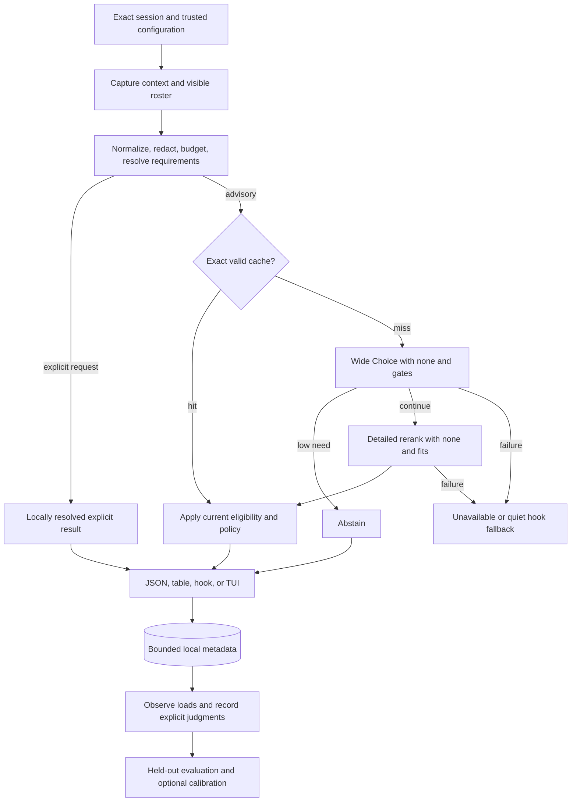

<div align="center">

# SkillRanker

**The right skill for the next step.**

A standalone Rust CLI that matches your agent's live conversation to the skills
it can actually load, with structured rankings, explicit abstention, and local
feedback you can inspect.

[](LICENSE)


```bash
sr rank --allow-network   # Rank skills for the selected session
sr hook claude           # Run the Claude Code prompt-hook integration
sr tui                   # Inspect rankings in an inline terminal display
```

</div>

## Contents

- [TL;DR](#tldr)
- [Quick Example](#quick-example)
- [Design Philosophy](#design-philosophy)
- [How It Compares](#how-it-compares)
- [Installation](#installation)
- [Quick Start](#quick-start)
- [Command Reference](#command-reference)
- [Configuration](#configuration)
- [How Ranking Works](#how-ranking-works)
- [Local Feedback And Calibration](#local-feedback-and-calibration)
- [Agent Hooks](#agent-hooks)
- [Inline TUI](#inline-tui)
- [Architecture](#architecture)
- [Privacy And Local State](#privacy-and-local-state)
- [Performance](#performance)
- [Troubleshooting](#troubleshooting)
- [Limitations](#limitations)
- [FAQ](#faq)
- [About Contributions](#about-contributions)
- [License](#license)

---

## TL;DR

**The problem.** A large skill library gives an agent plenty of procedures to
choose from, but choosing is itself a task. Similar descriptions obscure useful
distinctions. A skill that helped at the start of a conversation can be irrelevant
three turns later. Loading a plausible but unsuitable skill consumes context and
can redirect otherwise sensible work.

**The solution.** SkillRanker (`sr`) combines the recent conversation, current
request, workspace signals, and the selected harness's visible skill inventory.
TypeSafe's Jev first compares the candidates broadly, then reads richer excerpts
from a shortlist and evaluates whether each one fits. Both comparisons include a
real “none of these” option. The result is advisory: the agent follows the user's
instructions and decides what to consult.

### Why `sr`?

| Need | What SkillRanker provides |
|---|---|
| Choose for the current step | Exact session identity, the newest prompt, recent tool evidence, and project signals |
| Suggest something the agent can load | Harness-aware visibility, override resolution, stable skill identities, and content revalidation |
| Respect an explicit request | Locally resolve a requested skill before probabilistic retrieval or ranking |
| Search a large library | Local BM25 prefiltering, admitting up to 254 skills plus a none option to each Choice |
| Separate similar skills | Detailed reranking with bounded descriptions and body excerpts |
| Recognize when no skill fits | Relevance gates, per-candidate fit checks, and sentinel-based abstention |
| Understand the result | Raw probabilities, local rank scores, confidence, eligibility, and provenance stay distinct |
| Keep the agent moving | A failed hook recommendation produces a quiet, non-blocking fallback |
| Review what happens | Local observation statistics, explicit usefulness judgments, and held-out evaluation |
| Control disclosure | Network opt-in, redacted payload preview, an offline mode, and separate persistence controls |

The approach builds on the [TypeSafe skill-suggestion recipe](https://docs.typesafe.ai/cookbooks/skill_suggestion).
SkillRanker adds session identity, harness visibility, bounded execution, and a
local evaluation loop. The [comprehensive plan](COMPREHENSIVE_PLAN_TO_DESIGN_SKILLRANKER.md)
explains the full design and acceptance criteria.

## Quick Example

```bash
# Inspect local configuration and the available adapters.
sr doctor --json
sr capabilities --json

# Inspect visible, shadowed, and excluded skill records.
sr roster --json

# Preview the redacted wide-pass request without network or persistence effects.
sr rank --context scratch/context.json --dry-run

# Evaluate an explicitly selected conversation.
sr rank --context scratch/context.json --allow-network --json

# Inspect raw distributions, discarded candidates, and score contributions.
sr rank --context scratch/context.json --allow-network --explain --json

# Preview the Claude hook settings change, then apply it.
sr install-hook claude
sr install-hook claude --apply

# Review observations without treating adoption as proof of usefulness.
sr stats --since 7d --by-skill

# Inspect description quality and suspected coverage gaps locally.
sr doctor --descriptions
sr gaps
```

## Design Philosophy

1. **Choose for the next action.** The current request matters, as do the recent
   failure, the task context, and the instructions already loaded.
2. **Resolve authority locally.** The user decides what is required or excluded.
   The harness determines what can be loaded. A model answer cannot change either.
3. **Separate preference from applicability.** Winning a comparison is not enough.
   A recommendation must survive fit, visibility, loaded-state, and none-option checks.
4. **Keep evidence inspectable.** Preserve provider estimates and local arithmetic.
   `--explain` exposes computations without inventing model-generated reasons.
5. **Separate adoption from usefulness.** Observing a load is useful telemetry.
   Learning a better policy requires independently judged examples and a holdout.
6. **Bound the whole invocation.** Input, discovery, subprocesses, networking,
   retries, persistence, and cleanup all consume one deadline.
7. **Stay standalone.** Discovery, parsing, redaction, retrieval, and feedback live
   in `sr`. No skill-manager service or private database is required.

## How It Compares

These are workflow choices, not benchmark rankings.

| Approach | Input to selection | Strength | Tradeoff |
|---|---|---|---|
| Manual selection | Your knowledge of the task and library | Direct control without a ranking service | Requires remembering each skill's coverage |
| Keyword search | A query over names and descriptions | Cheap local discovery | Synonyms and adjacent procedures can be hard to distinguish |
| Load every skill | The full library's instructions | Makes every procedure available immediately | Consumes context regardless of relevance |
| SkillRanker | Exact session, visible roster, and explicit constraints | Evaluates candidates and can abstain | Fresh Jev evaluations require authorized network access |

SkillRanker recommends procedures. It does not execute skills, grant permissions,
or override the agent's governing instructions.

## Installation

### From source

```bash
git clone https://github.com/Dicklesworthstone/skillranker.git
cd skillranker
cargo install --locked --path . --bin sr
```

Include the inline TUI with its optional feature:

```bash
cargo install --locked --path . --bin sr --features tui
```

For a checkout-local binary:

```bash
cargo build --locked --release --bin sr
./target/release/sr capabilities --json
```

### Runtime setup

Set `TYPESAFE_API_KEY` through your shell or secret manager. The
[environment example](.env.example) lists the service settings. A local `.env`
is ignored by Git; export its values into the process environment before running
`sr`. Credentials alone do not enable remote transmission.

| Component | Role |
|---|---|
| TypeSafe API key | Authenticates fresh Jev evaluations |
| Network opt-in | `--allow-network` for a run, or `network.enabled` in trusted user configuration |
| Visible skill inventory | Harness-resolved skills or an explicit roster file |
| Session input | Claude hook, normalized context, supported native transcript, or optional cass export |
| [cass](https://github.com/Dicklesworthstone/coding_agent_session_search) | Optional archive discovery and access across coding-agent formats |

`sr` does not require `ms`, a local inference server, or an embedding model.
The primary local platform scope is Linux and macOS. Consult
`sr capabilities --json` for the adapters, events, and optional features in a build.

## Quick Start

1. **Check the environment.** Run `sr doctor --json` and inspect the supported
   interfaces with `sr capabilities --json`. Neither needs a network key.
2. **Check the roster.** Run `sr roster --json` in the agent's workspace.
   Confirm that candidates are loadable, not merely present somewhere on disk.
3. **Choose the session.** Supply `--context FILE`,
   `--transcript FILE --harness claude_code`, or `--session PATH` for cass.
   Automatic discovery must resolve one unambiguous session.
4. **Preview and rank.** Use `--dry-run` to inspect the redacted wide payload,
   then `--allow-network --json` for a fresh evaluation.
5. **Try the hook in shadow mode.** Preview and apply `sr install-hook claude`.
   Shadow mode records observations without adding suggestions to agent context.
6. **Enable advisory output deliberately.** Set `hook.mode = "advisory"` in
   trusted user configuration after reviewing the integration and its behavior.

## Command Reference

Bare `sr` is equivalent to `sr rank`: a table on a TTY, JSON otherwise. It does
not start a TUI. Source flags are mutually exclusive, and piped stdin is consumed
only by an explicit input mode.

### Ranking and inspection

| Command | Purpose | Example |
|---|---|---|
| `sr rank` | Rank the next step | `sr rank --allow-network --json` |
| `sr rank --context FILE` | Read normalized context; `-` means stdin | `sr rank --context scratch/context.json --dry-run` |
| `sr rank --transcript FILE --harness NAME` | Read a supported native transcript | `sr rank --transcript scratch/session.jsonl --harness claude_code --offline` |
| `sr rank --session PATH` | Export an exact session through cass | `sr rank --session scratch/session.jsonl --allow-network` |
| `sr hook claude` | Handle the Claude prompt-hook protocol | `sr hook claude --shadow` |
| `sr roster --json` | Inspect visibility, overrides, records, and exclusions | `sr roster --json` |
| `sr doctor --json` | Inspect local configuration and readiness | `sr doctor --json` |
| `sr capabilities --json` | Describe commands, schemas, features, limits, and exits | `sr capabilities --json` |
| `sr tui` | Open the inline viewer | `sr tui` |

### Hooks, feedback, and analysis

| Command | Purpose | Example |
|---|---|---|
| `sr install-hook claude` | Preview a managed hook settings change | `sr install-hook claude --apply` |
| `sr uninstall-hook claude` | Preview removal of the managed entry | `sr uninstall-hook claude --apply` |
| `sr stats` | Report observation and operational metrics | `sr stats --since 7d --by-skill` |
| `sr observe` | Reconcile structured load events | `sr observe --session scratch/session.jsonl` |
| `sr feedback` | Record an explicit usefulness judgment | `sr feedback EVENT_ID --skill SKILL_ID --verdict useful` |
| `sr eval` | Evaluate a labeled dataset | `sr eval --dataset scratch/evaluation.json` |
| `sr calibrate` | Report a candidate threshold configuration | `sr calibrate --evaluation scratch/report.json` |
| `sr doctor --descriptions` | Check description quality locally | `sr doctor --descriptions` |
| `sr gaps` | Report suspected coverage gaps | `sr gaps` |
| `sr ledger prune` | Preview retention cleanup | `sr ledger prune --before 2026-09-01` |
| `sr ledger clear` | Preview clearing local history | `sr ledger clear` |

`--apply` performs a previewed hook, calibration, or ledger mutation. Calibration
consumes a labeled evaluation artifact; it does not silently change project
settings after a number of observed loads. Description audits use the network
only with an explicit online request and network authorization.

### Ranking controls

| Flag | Default | Meaning |
|---|---|---|
| `--messages N` | `12` | Recent logical messages |
| `--budget-chars N` | `12000` | Rendered context budget, including the latest request |
| `--top K` | `5` | Maximum eligible suggestions returned |
| `--shortlist M` | `8` | Real candidates admitted to the rerank |
| `--gate F` | `0.30` | Overall need threshold |
| `--fits F` | `0.30` | Minimum candidate fit |
| `--timeout-ms N` | `3000` | Whole-invocation deadline |
| `--roster FILE` | Harness discovery | Replace discovery with an explicit inventory |
| `--require-skill ID` | None | Resolve an explicit required skill; repeatable |
| `--latest` | Off | Explicitly choose the newest discovered session |
| `--no-tools` | Off | Remove tool arguments and results from outgoing context |
| `--no-cache` | Off | Disable response-cache reads and writes |
| `--no-ledger` | Off | Disable observations, labels, and personalization |
| `--no-persist` | Off | Disable all persistent state, including cache, cursors, and locks |
| `--offline` | Off | Guarantee zero network calls |
| `--allow-network` | Off | Authorize network evaluation for this invocation |
| `--explain` | Off | Include distributions, exclusions, truncation, and score contributions |
| `--dry-run` | Off | Preview the redacted request without network or persistence effects |

Sizes satisfy `1 ≤ K ≤ M ≤ 32`; fewer available candidates is normal. Parsing
is strict, with documented aliases only. Invalid or conflicting privacy flags
produce an error rather than being silently corrected.

An explicit chunk-overflow experiment uses bounded groups and reduction rounds.
It has separate request limits and availability in the capabilities contract;
the normal overflow policy uses local prefiltering.

### JSON output

This illustrative result has two eligible candidates. The score arithmetic uses
`w_fit = 1`, with priors and phase weighting disabled; timing and usage are examples.

```json
{
  "schema_version": 1,
  "event_id": "example-event-001",
  "decision": "ranked",
  "reason": "eligible-candidates",
  "harness": "claude_code",
  "context_quality": "complete",
  "roster": {
    "total": 2,
    "eligible": 2,
    "wide_candidates": 2,
    "shortlist": 2,
    "partial": false,
    "retrieval": "full"
  },
  "needs_skill": 0.74,
  "choice_confidence": 0.81,
  "none_probability": 0.10,
  "phase": "debugging",
  "skills": [
    {
      "rank": 1,
      "skill_id": "s_01",
      "name": "rust-test-triage",
      "invocation_name": "rust-test-triage",
      "rank_score": 0.888889,
      "rerank_probability": 0.60,
      "wide_probability": 0.55,
      "fits": 0.80,
      "path": ".claude/skills/rust-test-triage/SKILL.md",
      "content_hash": "example-content-digest-01"
    },
    {
      "rank": 2,
      "skill_id": "s_02",
      "name": "rust-code-review",
      "invocation_name": "rust-code-review",
      "rank_score": 0.111111,
      "rerank_probability": 0.30,
      "wide_probability": 0.35,
      "fits": 0.50,
      "path": ".claude/skills/rust-code-review/SKILL.md",
      "content_hash": "example-content-digest-02"
    }
  ],
  "omitted_rank_mass": 0.0,
  "cache": { "hit": false, "age_ms": null, "stale": false },
  "model": { "requested": "jev-latest", "returned": "example-model-revision" },
  "usage": {
    "requests": 2,
    "http_attempts": 2,
    "input_tokens": 6400,
    "output_tokens": 480,
    "unknown_usage_attempts": 0
  },
  "persistence": "recorded",
  "warnings": [],
  "elapsed_ms": 720
}
```

| Decision | Meaning |
|---|---|
| `ranked` | Up to K eligible suggestions from a successful evaluation |
| `explicit` | Locally resolved user requests, with no invented model certainty |
| `abstain` | Valid input and policy produced no advisory recommendation |
| `unavailable` | An operational, input, privacy, or coverage problem prevented a decision |

`choice_confidence` describes the rerank distribution. `fits` is a model estimate
of suitability. `rank_score` is a relative local score over eligible candidates.
They are different quantities. Top-K truncation preserves the original eligible
normalization and reports omitted mass. Fields from an unexecuted stage are
`null`, not fabricated zeros.

### Exit codes

| Code | Meaning |
|---|---|
| `0` | Ranked, explicit, valid abstention, or successful inspection |
| `2` | Invalid usage or configuration |
| `3` | Missing or ambiguous session |
| `4` | Provider, authentication, or network failure |
| `5` | Empty, unusable, or unresolved requested roster |
| `6` | Overall deadline exhausted |
| `7` | Malformed, oversized, or unsupported input |
| `8` | Network transmission disallowed |
| `9` | Required storage or administrative mutation failed |
| `10` | Invalid structured provider response |

JSON errors include `schema_version`, `decision: "unavailable"`, and an `error`
object with `code`, kebab-case `kind`, `message`, `hint`, and `retryable`.
Ordinary ranking can succeed with a storage warning; an explicit feedback write
cannot claim success when its required write failed.

The dedicated hook maps recommendation failures to quiet exit-zero behavior so
it never blocks the agent. CLI failures retain their meaningful exit codes.

## Configuration

Ordinary settings resolve from lowest to highest priority:

```text
built-in defaults
  -> trusted user configuration
  -> allowlisted workspace configuration
  -> recognized SR_* environment variables
  -> command-line flags
```

On Linux, user configuration falls back to `~/.config/sr/config.toml`; project
configuration is `.sr/config.toml` at the workspace root. Other platforms use
native configuration directories.

Trusted user settings for an advisory hook include:

```toml
[network]
enabled = true

[hook]
mode = "advisory"
```

Without those choices, remote transmission is disabled and the hook runs in
shadow mode. `--allow-network` can authorize a single CLI evaluation.

| Variable | Purpose |
|---|---|
| `TYPESAFE_API_KEY` | TypeSafe bearer credential; never serialized or stored in project config |
| `TYPESAFE_ENDPOINT` | Trusted HTTPS endpoint override with origin-scoped credentials |
| `SR_MODEL` | Requested model; default `jev-latest` |
| Recognized `SR_*` settings | Ordinary configuration overrides described by capabilities |

Workspace configuration may tune bounded ranking values and exclusions. It
cannot authorize networking, change endpoints/proxies, supply credentials,
expand transcript access, disable redaction, or enable raw retention. Unknown
keys and invalid values are reported before I/O.

## How Ranking Works

### 1. Establish the exact context

The Claude hook uses the incoming prompt as the current request, even when the
transcript has not yet recorded it. Context, cursors, and feedback belong to a
specific workspace, session, and agent branch. An explicit source that fails does
not silently fall through to another conversation.

Native JSONL reads process complete records within a bounded tail. Replacement,
truncation, compaction, and incomplete final lines are handled explicitly. An
empty first transcript can still yield prompt-only context; malformed existing
history is a different condition.

Windowing drops reasoning blocks, binary/media payloads, and prior `sr` advice.
Tool summaries preserve invocation/result association and useful failure lines.
The latest request gets budget priority, with explicit head/tail truncation for
oversized input. Redaction runs on complete bounded fields before truncation,
then on the assembled provider payload.

Project signals use language/framework filenames, allowlisted tools on a trusted
PATH, and bounded repository-relative dirty paths. Absolute workspace paths and
branch names remain local by default.

### 2. Resolve what is loadable

An explicit `--roster FILE` replaces discovery. Otherwise, a harness inventory
or its visibility adapter determines roots, overrides, plugins, and load targets.
The presence of a directory does not mean the selected harness loads its skills.
Generic file mode uses explicitly configured roots and exposes uncertain visibility.

Each skill has an opaque stable ID, its actual invocation name, display name,
source, content hash, load target, metadata, and visibility. Same-name skills
remain distinct where the harness permits; shadowed or ambiguously invocable
entries are excluded from hook suggestions.

| Resource | Default bound |
|---|---:|
| Hook stdin | 1 MiB |
| Transcript tail | 2 MiB / 2,000 records |
| One transcript record | 256 KiB |
| cass stdout | 8 MiB |
| Skill file / frontmatter | 256 KiB / 16 KiB |
| Discovery | 10,000 files / 32 MiB parsed bytes |
| Wide description | 160 characters |
| Rerank description / body excerpt | 1,000 / 700 characters |
| Serialized provider request / response | 96 KiB / 2 MiB |

Source snapshots supply both hashes and excerpts. Candidates are checked again
before emission so a file changed during inference cannot remain an actionable
stale recommendation.

### 3. Retrieve, then compare

Explicit requirements are resolved from the complete visible roster first.
They bypass probabilistic retrieval and cannot be vetoed by a low gate.

For advisory ranking, in-memory BM25 narrows larger rosters to **254 real skills**.
The 255th Choice entry is `__none__`. Retrieval uses the latest request plus
bounded task and error context; a terse “continue” retains useful prior evidence.

The wide pass combines a Choice, phase distribution, and three oriented gates:

```text
needs_skill = mean(
    specialized_method,
    material_help,
    1 - context_suffices
)
```

`needs_skill` is a heuristic score. Below the default `0.30` threshold, `sr`
abstains without a rerank. The wording includes planning, analysis, writing, and
explanation skills; acting on files is not a prerequisite for needing a method.

When the gate passes, up to eight real candidates proceed to a detailed Choice
with another none option and one fit Noul per candidate. The client uses the
[TypeSafe HTTP API](https://docs.typesafe.ai/api), preserving typed answers and
validating every requested option before scoring.

### 4. Apply eligibility and rank survivors

A candidate is removed if it is excluded, unavailable, known loaded with unchanged
content in the current context epoch, or below the fit threshold. If the none
option then ties or exceeds the best surviving rerank probability, `sr` abstains.
Local priors cannot reverse that decision.

For each eligible candidate:

```text
eps = 1e-6
clip(x) = min(1 - eps, max(eps, x))
log_odds(x) = ln(clip(x) / (1 - clip(x)))

utility_i = ln(clip(p_rerank_i))
          + w_fit   * log_odds(fits_i)
          + w_prior * prior_delta_i
          + w_phase * phase_match_i

rank_score_i = softmax(utility)_i
```

Defaults are `w_fit = 1.0`, `w_prior = 0.0`, and `w_phase = 0.0`.
Priors and phase weighting are optional evaluated policy choices. A skill is
not penalized just because a previous suggestion went unobserved. After
compaction, uncertain loaded-state evidence cannot suppress a skill indefinitely.

## Local Feedback And Calibration

SkillRanker keeps observations and judgments separate.

| Record | What it establishes |
|---|---|
| Generated ranking | The selector produced a result |
| Successful stdout write | An emission occurred; harness consumption is still separate |
| Load attempt | A structured tool tried to load a resolved skill |
| Observed successful load | The adapter saw a successful load of that skill version |
| Not observed / unobservable / censored | The available record cannot establish an outcome |
| Explicit usefulness judgment | An assessor labeled a particular event and skill version |

`sr stats` reports adoption, observation coverage, censoring, latency, errors,
abstentions, cache reuse, and actual provider usage, with denominators. Those
operational metrics are not labeled task success or recommendation precision.

```bash
sr observe --session scratch/session.jsonl
sr stats --since 7d --by-skill
sr feedback EVENT_ID --skill SKILL_ID --verdict useful
sr eval --dataset scratch/labeled-cases.json
sr calibrate --evaluation scratch/evaluation-report.json
sr calibrate --evaluation scratch/evaluation-report.json --apply
```

Calibration uses independently judged positive, no-match, and near-miss cases,
with session/task-family separation and held-out evaluation. The objective
penalizes wrong suggestions, needless suggestions, and missed useful suggestions;
always staying silent is not a successful policy.

Experimental priors use centered, shrunk Beta(1, 4) estimates from judged
usefulness. They are disabled by default and can only reorder eligible candidates.
A fixed observation count alone never enables learning.

Description diagnostics flag missing metadata, duplicate visible prefixes, and
rerank disagreements. Gap reports identify **suspected** missing coverage while
showing retrieval and context quality. Text clustering requires separately enabled
retention of redacted excerpts; metadata cannot reconstruct a private request.
Neither command edits skills or invokes a skill manager.

## Agent Hooks

The Claude Code integration uses `UserPromptSubmit` and the dedicated
`sr hook claude` protocol boundary. Advisory output uses the harness's
`hookSpecificOutput` envelope:

```json
{
  "hookSpecificOutput": {
    "hookEventName": "UserPromptSubmit",
    "additionalContext": "Suggested skill for the next step: rust-test-triage. Use it only if it fits the user's request and current instructions."
  }
}
```

The normal hook names at most one locally validated skill. Multiple explicitly
requested skills remain user requests, not adaptive top-three suggestions.
A valid abstention may offer a short no-additional-skill message. Operational
failures and incomplete coverage produce no injected text.

**The hook never blocks the agent on a recommendation failure.** It emits no
blocking decision fields and translates errors into empty stdout, a sanitized
stderr diagnostic, and exit zero. Shadow mode suppresses both suggestions and
abstention text while retaining permitted local observations.

```bash
sr install-hook claude                  # Preview the exact settings change
sr install-hook claude --apply          # Merge the managed entry with a backup
sr hook claude --shadow                 # Explicitly keep the hook observational
sr uninstall-hook claude --apply        # Remove only the managed entry
```

Installation uses a trusted absolute executable path, escaped arguments, and a
harness timeout above the ranker's deadline. Repeated installation is idempotent;
unrelated settings are preserved, and concurrent or malformed edits are reported.

Other harnesses can supply versioned normalized context through
`sr rank --context FILE`. Native integration support is enumerated by capabilities;
a post-turn notification is not interchangeable with a pre-turn recommendation hook.

## Inline TUI

```bash
sr tui
```

The optional FrankenTUI display uses an inline layout of roughly nine rows in a
dedicated pane or terminal. It shows relative rank score, fit, source, freshness,
and decision status. Small terminals use fewer rows and readable text.

| Key | Action |
|---|---|
| `1`–`5` | Select a locally resolved skill target |
| `r` | Request a refresh |
| `w` | Toggle bounded transcript watch |
| `e` | Show distributions and supporting evidence |
| `q` | Exit and restore terminal state |

Selection never invokes a loader or shell command. Machine-readable selection
output stays separate from terminal rendering. Watch mode permits one active
ranking per session, coalesces changes, and enforces a minimum five-second interval.
A superseded result cannot replace a newer generation's display.

## Architecture



| Component | Responsibility |
|---|---|
| `context/` | Exact source selection, Claude and normalized adapters, optional cass, windowing, and project signals |
| `privacy/` | Local redaction and trusted network, root, field, and persistence policy |
| `roster/` | Harness visibility, bounded parsing, stable identities, and local BM25 |
| `jev/` | Asupersync HTTPS, typed protocol validation, question builders, eligibility, and scores |
| `ledger/` | SQLite transactions, observations, judgments, evaluation provenance, and optional priors |
| `output/` | Versioned JSON, human table, Claude protocol, and optional TUI |
| `cache.rs` | Separate request and decision fingerprints, TTL, and revalidation |
| `hook_install.rs` | Managed configuration preview, apply, backup, and rollback |

One Rust package contains `sr` and reusable pure pipeline components. Asupersync
owns task lifetimes, deadlines, HTTP/TLS, and deterministic lab replay. SQLite
persistence uses `rusqlite` with bundled SQLite. FrankenTUI is optional.

Selected parsing and redaction code can be adapted from
[meta_skill](https://github.com/Dicklesworthstone/meta_skill) with source provenance
and license notices. SkillRanker does not invoke its CLI, link its application,
read its private database, or write outcomes back to it.

## Privacy And Local State

**Fresh Jev evaluations send redacted context and skill excerpts to TypeSafe.**
Networking requires a trusted setup choice. Project files cannot enable it just
because an API key is present. `--offline` guarantees zero network requests and
can use local explicit resolution or an exact valid cache entry.

| Control | Effect |
|---|---|
| `--dry-run` | Preview exact redacted wide-request bytes; no network or persistence changes |
| `--no-tools` | Remove tool arguments and results from provider context |
| `--no-cache` | Disable cache reads and writes |
| `--no-ledger` | Disable observations, judgments, and personalization |
| `--no-persist` | Also disable persistent cache, cursors, locks, and other local state |
| `--offline` | Disallow all network activity |

A second-stage dry run requires explicit shortlist IDs or a validated recorded
wide answer. It cannot know a model's shortlist without that evidence.

Local data uses platform directories, including `$XDG_DATA_HOME/sr` on Linux
with `~/.local/share/sr` as the fallback. Database and cache files are owner-only.
Raw transcripts and request bodies are not retained by default. Event metadata
has a default 30-day retention policy; response-cache entries expire after at
most ten minutes. Retention cleanup is an explicit ledger operation outside the hook.

Requests use HTTPS with credential-scoped endpoints and redirects disabled.
Redaction covers outgoing roster excerpts as well as conversation fields, but
it cannot identify every piece of confidential prose. Review dry-run output
before sharing it. There is no cross-user telemetry or remote feedback sink.

## Performance

The principal performance contract is a **three-second whole-invocation
budget**, beginning at process entry and reserving the final 200 ms for output
and cleanup. The Claude harness timeout is initially four seconds.

| Path | Engineering target |
|---|---|
| Exact cache hit | p95 at or below 100 ms |
| Warm hook requiring the network | p50 at or below 600 ms; p95 at or below 1,500 ms |
| Cold CLI or cass discovery | The same configurable deadline, with stage timings |

These targets are not remote-service guarantees or measured benchmark results.
Process startup, cold TLS, roster size, discovery, and provider load all matter.

Input capture and roster discovery overlap after identity is established.
The two inference stages remain sequential. Low-need decisions skip the rerank.
The normal budget is two logical requests and at most four HTTP attempts total;
retries and `Retry-After` consume the same remaining deadline.

Cache keys cover exact request inputs and current decision policy. New tool
evidence, compaction, skill-content changes, exclusions, model/endpoint identity,
and session changes can invalidate reuse. Stale results cannot drive hook output.
Cache hits report zero new requests and tokens; unanswered attempts retain an
unknown-usage marker rather than being counted as free.

## Troubleshooting

| Symptom | Next step |
|---|---|
| Missing or ambiguous session, exit `3` | Select `--context`, `--transcript` with its harness, or an exact `--session`; use `--latest` only when that is your intent |
| Empty or unusable roster, exit `5` | Inspect `sr roster --json` for visibility, shadowing, malformed metadata, and source failures |
| Provider/authentication error, exit `4` | Inspect `sr doctor --json` and the sanitized error; check credentials without printing them |
| Overall timeout, exit `6` | Inspect stage timings; prefer direct hook/context input or deliberately adjust `--timeout-ms` |
| Unsupported input, exit `7` | Check `sr capabilities --json` and supply a supported adapter or normalized context |
| Networking denied, exit `8` | Use `--offline`, or explicitly choose `--allow-network` or trusted user network configuration |
| No visible hook suggestions | Check whether the hook is in shadow mode, networking is disabled, or the decision is unavailable/abstain |
| A similar but wrong skill wins | Inspect `--explain`, provide a usefulness judgment, and review description and retrieval quality |
| A known skill is missing | Check the selected harness's visibility and overrides; an explicit roster replaces discovery |
| TUI unavailable | Build with `--features tui`, or use table/JSON output |

## Limitations

- Fresh inference depends on TypeSafe. Local inspection and response caching do
  not make SkillRanker an offline model.
- A roster's visibility and retrieval quality bound what can be recommended.
  Low shortlist fit alone cannot prove that the full library lacks a useful skill.
- Load observations are incomplete and affected by the suggestion itself.
  Controlled, independently judged outcomes are needed for task-improvement claims.
- Lexical retrieval can miss paraphrases and multilingual matches. Chunked
  comparisons add cost and can still discard a correct candidate.
- Native harness support requires its own verified event, visibility, prompt,
  and delivery contract. Normalized-context input is the portable integration boundary.
- Provider aliases can change, so cached responses and evaluations identify both
  the requested model and returned identity/time range.
- Redaction is fallible. Large or incomplete context carries truncation and
  quality metadata rather than a claim that nothing important was omitted.

## FAQ

**Does SkillRanker execute a skill?**
No. It recommends or returns a locally resolved target. The agent remains in
control of loading and execution under the user's instructions.

**Can it veto a skill I explicitly asked for?**
No. Explicit requests are resolved locally before probabilistic ranking. Missing
or ambiguous requests are reported rather than replaced with a similar skill.

**Why include both a none option and fit questions?**
The none option competes in the same distribution as the candidates. Fit questions
independently estimate suitability. Both participate in the final eligibility policy.

**Is `rank_score` a probability of success?**
No. It is a normalized relative score among eligible shortlist candidates. A lone
survivor scores one without becoming certainly useful.

**Does a popular skill automatically get recommended more?**
No. Priors are disabled by default and use judged usefulness when enabled.
Unobserved loads do not become automatic negative labels or ignore penalties.

**Do I need cass or meta_skill?**
Cass is optional for session archive access. Meta_skill is a source of selected
reusable code, not a runtime dependency or feedback service.

**Does `--no-ledger` make the run stateless?**
No. It disables observations, labels, and personalization. Use `--no-persist` to
also disable persistent cache, cursors, and coordination state.

**Can the hook stop my agent if TypeSafe is unavailable?**
No. The dedicated hook produces a quiet non-blocking fallback. The ordinary CLI
still reports the failure with a structured error and meaningful exit code.

**Can it explain the model's reasoning?**
`--explain` exposes returned distributions, exclusions, and score contributions.
It does not invent free-text reasoning absent from the provider response.

## About Contributions

*About Contributions:* Please don't take this the wrong way, but I do not accept outside contributions for any of my projects. I simply don't have the mental bandwidth to review anything, and it's my name on the thing, so I'm responsible for any problems it causes; thus, the risk-reward is highly asymmetric from my perspective. I'd also have to worry about other "stakeholders," which seems unwise for tools I mostly make for myself for free. Feel free to submit issues, and even PRs if you want to illustrate a proposed fix, but know I won't merge them directly. Instead, I'll have Claude or Codex review submissions via `gh` and independently decide whether and how to address them. Bug reports in particular are welcome. Sorry if this offends, but I want to avoid wasted time and hurt feelings. I understand this isn't in sync with the prevailing open-source ethos that seeks community contributions, but it's the only way I can move at this velocity and keep my sanity.

## License

SkillRanker is licensed under the [MIT License with OpenAI/Anthropic Rider](LICENSE),
Copyright (c) 2026 Jeffrey Emanuel. The rider is part of the license; this is not
unmodified MIT. License identifier: `LicenseRef-MIT-OpenAI-Anthropic-Rider`.

## See Also

- [Comprehensive plan](COMPREHENSIVE_PLAN_TO_DESIGN_SKILLRANKER.md): design, contracts, and acceptance criteria.
- [AGENTS.md](AGENTS.md): engineering rules and verification obligations.
- [CHANGELOG.md](CHANGELOG.md): repository history.
- [Asupersync](https://github.com/Dicklesworthstone/asupersync): structured concurrency and deterministic runtime testing.
- [FrankenTUI](https://github.com/Dicklesworthstone/frankentui): terminal presentation.
- [cass](https://github.com/Dicklesworthstone/coding_agent_session_search): session archive access.
- [meta_skill](https://github.com/Dicklesworthstone/meta_skill): source prior art for selected standalone components.
